# نمودارهای معماری و فرایند

این سند نقشهٔ فنی و رفتاری پیاده‌سازی فعلی ربات است. هدف آن این است که توسعه‌دهنده یا agent تازه، پیش از تغییر کد مرزهای سیستم، مالکیت داده، گذارهای وضعیت و نقاط بازیابی پس از خطا را سریع بفهمد. فایل مستقل هر نمودار در پوشهٔ [`diagrams`](diagrams/) قرار دارد و همین نمودارها برای مرور مستقیم در GitHub نیز در ادامه رندر می‌شوند.

## راهنمای خواندن و نگهداری

- نمودارها نمای فشردهٔ رفتار کدهای `app/bot.py`، `app/db.py`، `app/admin.py` و `app/schema.sql` هستند؛ معیار پذیرش، درخواست مستقیم کاربر و نیازمندی‌های اصلی پذیرفته‌شده است و کد یا نمودار ناسازگار باید اصلاح شود.
- `ready` یعنی محصول دارای payload قابل تحویل از انبار؛ `manual` یعنی محصولی که پس از پرداخت به اطلاعات کاربر و اقدام مدیر نیاز دارد.
- `payment` می‌تواند متعلق به سفارش یا شارژ کیف پول باشد. برداشت کیف پول در ledger تغییرناپذیر ثبت می‌شود و ممکن است بخشی از مبلغ سفارش را پوشش دهد.
- پیام پایدار یعنی ابتدا در `outbound_messages` با `idempotency_key` ثابت ثبت می‌شود و worker مسئول ارسال و retry است.
- هر تغییری در statusها، روابط دیتابیس، ترتیب maintenance یا مجوز نقش‌ها باید هم‌زمان در نمودار مرتبط اصلاح و با تست‌ها بررسی شود.
- برای رندر محلی می‌توان محتوای هر فایل `.mmd` را در Mermaid CLI یا Mermaid Live باز کرد. GitHub بلوک‌های Mermaid همین سند را مستقیماً نمایش می‌دهد.

## ۱. System context

نمای بیرونی سیستم و سرویس‌هایی که با آن ارتباط دارند. callback بانکی با webhook تلگرام یکی نیست.

[منبع Mermaid](diagrams/01-system-context.mmd) · [خروجی SVG](diagrams/rendered/01-system-context.svg)

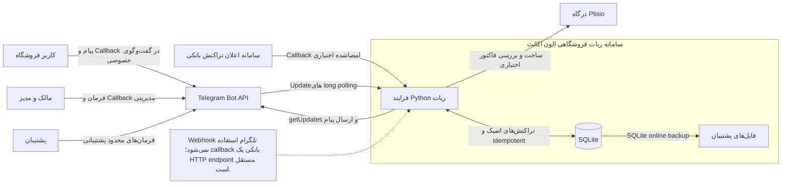
```mermaid
flowchart LR
    User["کاربر فروشگاه"]
    Owner["مالک و مدیر"]
    Support["پشتیبان"]
    Bank["سامانه اعلان تراکنش بانکی"]
    Plisio["درگاه Plisio"]
    Telegram["Telegram Bot API"]

    subgraph System["سامانه ربات فروشگاهی الون اکانت"]
        Bot["فرایند Python ربات"]
        Database[("SQLite")]
        Backup["فایل‌های پشتیبان"]
    end

    User -->|"پیام و Callback در گفت‌وگوی خصوصی"| Telegram
    Owner -->|"فرمان و Callback مدیریتی"| Telegram
    Support -->|"فرمان‌های محدود پشتیبانی"| Telegram
    Bot -->|"getUpdates و ارسال پیام"| Telegram
    Telegram -->|"Updateهای long polling"| Bot
    Bank -->|"Callback امضاشده اختیاری"| Bot
    Bot -->|"ساخت و بررسی فاکتور اختیاری"| Plisio
    Bot <-->|"تراکنش‌های اتمیک و idempotent"| Database
    Database -->|"SQLite online backup"| Backup

    Note["Webhook تلگرام استفاده نمی‌شود؛ callback بانکی یک HTTP endpoint مستقل است."]
    Note -.-> Bot
```

## ۲. معماری componentها

وابستگی‌های سطح ماژول را نشان می‌دهد. منطق اتمیک مالی و قواعد انتقال وضعیت باید در repository باقی بماند؛ لایهٔ bot آن را با Telegram و worker هماهنگ می‌کند. خطای موقت پایهٔ DB از BotApplication به poller با NACK صریح برمی‌گردد تا offset ثابت بماند.

[منبع Mermaid](diagrams/02-component-architecture.mmd) · [خروجی SVG](diagrams/rendered/02-component-architecture.svg)

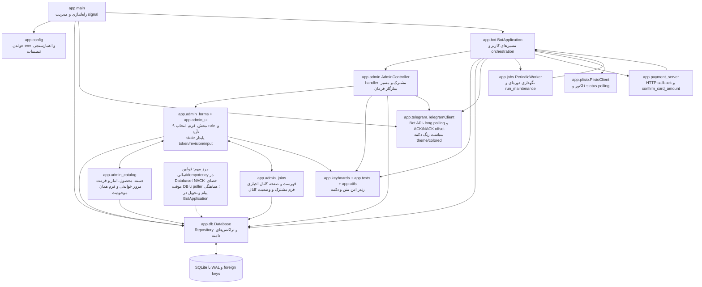
```mermaid
flowchart TB
    Entry["app.main<br/>راه‌اندازی و مدیریت signal"]
    Config["app.config<br/>خواندن env و اعتبارسنجی تنظیمات"]
    Bot["app.bot.BotApplication<br/>مسیرهای کاربر و orchestration"]
    Admin["app.admin.AdminController<br/>handler مشترک و مسیر سازگار فرمان"]
    Forms["app.admin_forms + app.admin_ui<br/>۹ بخش، فرم، انتخاب، role و تأیید<br/>state پایدار token/revision/input"]
    Catalog["app.admin_catalog<br/>دسته، محصول، انبار و فرمت<br/>مرور خواندنی و فرم همان موجودیت"]
    Joins["app.admin_joins<br/>فهرست و صفحه کانال اجباری<br/>فرم مشترک و وضعیت کانال"]
    UI["app.keyboards + app.texts + app.utils<br/>رندر امن متن و دکمه"]
    Repo["app.db.Database<br/>Repository و تراکنش‌های دامنه"]
    TG["app.telegram.TelegramClient<br/>Bot API، long polling و ACK/NACK offset<br/>سیاست رنگ دکمه theme/colored"]
    Worker["app.jobs.PeriodicWorker<br/>نگهداری دوره‌ای و run_maintenance"]
    Card["app.payment_server<br/>HTTP callback و confirm_card_amount"]
    Crypto["app.plisio.PlisioClient<br/>فاکتور و status polling"]
    DB[("SQLite با WAL و foreign keys")]

    Entry --> Config
    Entry --> Repo
    Entry --> TG
    Entry --> Bot
    Bot --> Admin
    Admin --> Forms
    Forms --> Repo
    Forms <--> Catalog
    Catalog --> Repo
    Forms <--> Joins
    Joins --> Repo
    Forms --> UI
    Bot --> UI
    Admin --> UI
    Bot --> Repo
    Admin --> Repo
    Bot --> TG
    Admin --> TG
    Bot --> Worker
    Worker --> Bot
    Bot --> Card
    Card --> Bot
    Bot --> Crypto
    Repo <--> DB

    Contract["مرز مهم: قوانین مالی/idempotency در Database؛ NACK خطای موقت DB تا poller؛ هماهنگی پیام و تحویل در BotApplication"]
    Contract -.-> Repo
```

## ۳. Deployment

این پروژه به‌صورت single instance طراحی شده است. persistence دیتابیس و secretها باید بیرون از image یا سورس نگهداری شوند. ACK offset را جلو می‌برد؛ NACK موقت DB ادامه همان batch را متوقف و retry سقف‌دار را از offset قبلی آغاز می‌کند.

[منبع Mermaid](diagrams/03-deployment.mmd) · [خروجی SVG](diagrams/rendered/03-deployment.svg)

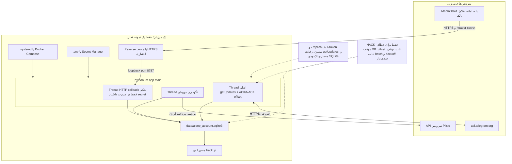
```mermaid
flowchart TB
    subgraph Internet["سرویس‌های بیرونی"]
        Telegram["api.telegram.org"]
        BankSource["MacroDroid یا سامانه اعلان بانک"]
        Plisio["API سرویس Plisio"]
    end

    subgraph Host["یک میزبان؛ فقط یک نمونه فعال"]
        Service["systemd یا Docker Compose"]
        subgraph Process["python -m app.main"]
            Poller["Thread اصلی<br/>getUpdates + ACK/NACK offset"]
            Maintenance["Thread نگهداری دوره‌ای"]
            Callback["Thread HTTP callback بانکی<br/>فقط در صورت داشتن secret"]
        end
        Env[".env یا Secret Manager"]
        Data["data/alone_account.sqlite3"]
        Backups["مسیر امن backup"]
        Proxy["Reverse proxy با HTTPS<br/>اختیاری"]
    end

    Service --> Process
    Env --> Process
    Poller <-->|"HTTPS خروجی"| Telegram
    Maintenance -->|"بررسی پرداخت ارزی"| Plisio
    BankSource -->|"HTTPS و header secret"| Proxy
    Proxy -->|"loopback port 8787"| Callback
    Poller --> Data
    Maintenance --> Data
    Callback --> Data
    Data --> Backups

    Warn["دو replica با یک token ممنوع: رقابت getUpdates و معماری تک‌نودی SQLite"]
    Warn -.-> Process
    Retry["NACK فقط برای خطای موقت DB: offset ثابت، توقف ادامه batch و backoff سقف‌دار"]
    Retry -.-> Poller
    Retry -.-> Data
```

## ۴. ER overview

این ERD عمداً جداول اصلی دامنه را نشان می‌دهد. جداول تنظیمات، schema metadata، update deduplication، broadcast join table، receipt attachment، evidence/resolutionهای card/provider، cancellation/security event و backup metadata برای خوانایی حذف شده‌اند و فهرست کامل آن‌ها در `DATA_MODEL.md` و `app/schema.sql` است. عبارت `snapshots_into` یادآور این است که Order نام، نوع، قیمت و مدت محصول را هنگام ایجاد snapshot می‌کند؛ `order_origin` خرید تجاری مشتری را از تخصیص داخلی مدیر جدا نگه می‌دارد.

[منبع Mermaid](diagrams/04-er-overview.mmd) · [خروجی SVG](diagrams/rendered/04-er-overview.svg)

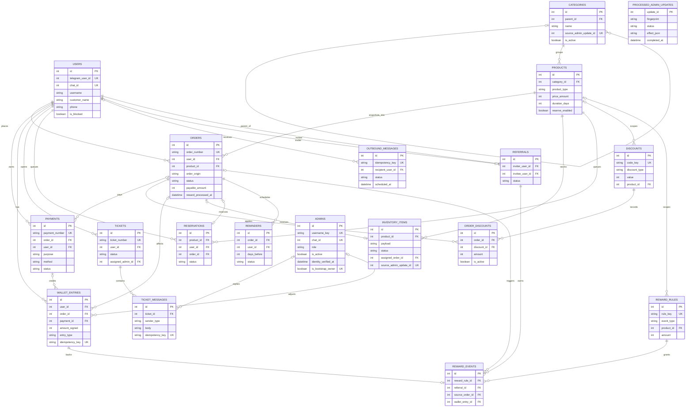
```mermaid
erDiagram
    USERS ||--o{ ORDERS : places
    USERS ||--o{ PAYMENTS : owns
    USERS ||--o{ WALLET_ENTRIES : has
    USERS ||--o{ TICKETS : opens
    USERS ||--o{ RESERVATIONS : queues
    USERS o|--o{ OUTBOUND_MESSAGES : receives
    USERS ||--o{ REFERRALS : inviter
    USERS ||--o| REFERRALS : invitee

    CATEGORIES o|--o{ CATEGORIES : parent_of
    CATEGORIES ||--o{ PRODUCTS : groups
    PRODUCTS ||--o{ ORDERS : snapshots_into
    PRODUCTS ||--o{ INVENTORY_ITEMS : stocks
    PRODUCTS ||--o{ RESERVATIONS : queues
    PRODUCTS o|--o{ DISCOUNTS : scopes
    PRODUCTS o|--o{ REWARD_RULES : scopes

    ORDERS o|--o{ PAYMENTS : pays
    ORDERS ||--o{ ORDER_DISCOUNTS : applies
    ORDERS o|--o{ WALLET_ENTRIES : affects
    ORDERS o|--o| INVENTORY_ITEMS : receives
    ORDERS o|--o| RESERVATIONS : reserves
    ORDERS ||--o{ REMINDERS : schedules
    ORDERS o|--o{ REWARD_EVENTS : triggers

    DISCOUNTS ||--o{ ORDER_DISCOUNTS : records
    PAYMENTS o|--o{ WALLET_ENTRIES : credits
    TICKETS ||--o{ TICKET_MESSAGES : contains
    ADMINS o|--o{ TICKET_MESSAGES : replies
    ADMINS o|--o{ WALLET_ENTRIES : adjusts
    REFERRALS ||--o{ REWARD_EVENTS : earns
    REWARD_RULES ||--o{ REWARD_EVENTS : grants
    WALLET_ENTRIES ||--o| REWARD_EVENTS : backs

    USERS {
        int id PK
        int telegram_user_id UK
        int chat_id UK
        string username
        string customer_name
        string phone
        boolean is_blocked
    }
    ADMINS {
        int id PK
        string username_key UK
        int chat_id UK
        string role
        boolean is_active
        datetime identity_verified_at
        boolean is_bootstrap_owner UK
    }
    PROCESSED_ADMIN_UPDATES {
        int update_id PK
        string fingerprint
        string status
        string effect_json
        datetime completed_at
    }
    CATEGORIES {
        int id PK
        int parent_id FK
        string name
        int source_admin_update_id UK
        boolean is_active
    }
    PRODUCTS {
        int id PK
        int category_id FK
        string product_type
        int price_amount
        int duration_days
        boolean reserve_enabled
    }
    ORDERS {
        int id PK
        string order_number UK
        int user_id FK
        int product_id FK
        string order_origin
        string status
        int payable_amount
        datetime reward_processed_at
    }
    PAYMENTS {
        int id PK
        string payment_number UK
        int order_id FK
        int user_id FK
        string purpose
        string method
        string status
    }
    INVENTORY_ITEMS {
        int id PK
        int product_id FK
        string payload
        string status
        int assigned_order_id FK
        int source_admin_update_id UK
    }
    RESERVATIONS {
        int id PK
        int product_id FK
        int user_id FK
        int order_id FK
        string status
    }
    DISCOUNTS {
        int id PK
        string code_key UK
        string discount_type
        int value
        int product_id FK
    }
    ORDER_DISCOUNTS {
        int id PK
        int order_id FK
        int discount_id FK
        int amount
        boolean is_active
    }
    WALLET_ENTRIES {
        int id PK
        int user_id FK
        int order_id FK
        int payment_id FK
        int amount_signed
        string entry_type
        string idempotency_key UK
    }
    TICKETS {
        int id PK
        string ticket_number UK
        int user_id FK
        string status
        int assigned_admin_id FK
    }
    TICKET_MESSAGES {
        int id PK
        int ticket_id FK
        string sender_type
        string body
        string idempotency_key UK
    }
    OUTBOUND_MESSAGES {
        int id PK
        string idempotency_key UK
        int recipient_user_id FK
        string status
        datetime scheduled_at
    }
    REFERRALS {
        int id PK
        int inviter_user_id FK
        int invitee_user_id FK
        string status
    }
    REWARD_RULES {
        int id PK
        string rule_key UK
        string event_type
        int product_id FK
        int amount
    }
    REWARD_EVENTS {
        int id PK
        int reward_rule_id FK
        int referral_id FK
        int source_order_id FK
        int wallet_entry_id FK
    }
    REMINDERS {
        int id PK
        int order_id FK
        int user_id FK
        int days_before
        string status
    }
```

## ۵. Use caseهای کاربر

قابلیت‌های قابل دسترس برای کاربر نهایی. همهٔ مسیرهای تعاملی به‌جز لینک عضویت کانال در گفت‌وگوی خصوصی ربات انجام می‌شوند.

[منبع Mermaid](diagrams/05-user-use-cases.mmd) · [خروجی SVG](diagrams/rendered/05-user-use-cases.svg)

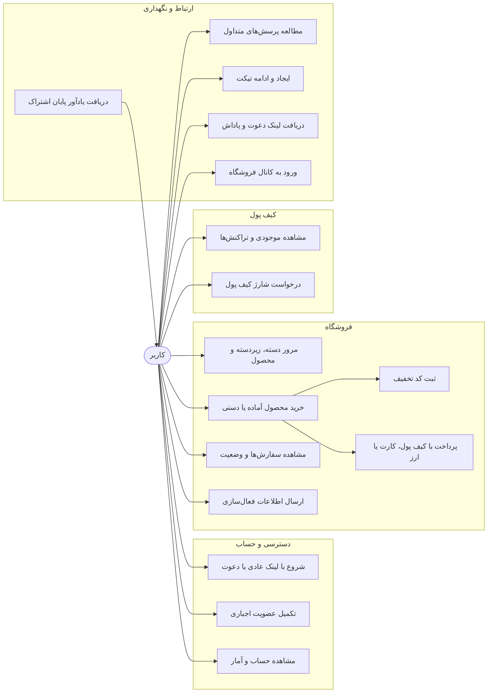
```mermaid
flowchart LR
    User(["کاربر"])

    subgraph Access["دسترسی و حساب"]
        Start["شروع با لینک عادی یا دعوت"]
        Join["تکمیل عضویت اجباری"]
        Profile["مشاهده حساب و آمار"]
    end

    subgraph Commerce["فروشگاه"]
        Browse["مرور دسته، زیردسته و محصول"]
        Buy["خرید محصول آماده یا دستی"]
        Discount["ثبت کد تخفیف"]
        Pay["پرداخت با کیف پول، کارت یا ارز"]
        Orders["مشاهده سفارش‌ها و وضعیت"]
        Info["ارسال اطلاعات فعال‌سازی"]
    end

    subgraph Wallet["کیف پول"]
        Balance["مشاهده موجودی و تراکنش‌ها"]
        Topup["درخواست شارژ کیف پول"]
    end

    subgraph Service["ارتباط و نگهداری"]
        FAQ["مطالعه پرسش‌های متداول"]
        Ticket["ایجاد و ادامه تیکت"]
        Referral["دریافت لینک دعوت و پاداش"]
        Channel["ورود به کانال فروشگاه"]
        Reminder["دریافت یادآور پایان اشتراک"]
    end

    User --> Start
    User --> Join
    User --> Profile
    User --> Browse
    User --> Buy
    Buy --> Discount
    Buy --> Pay
    User --> Orders
    User --> Info
    User --> Balance
    User --> Topup
    User --> FAQ
    User --> Ticket
    User --> Referral
    User --> Channel
    Reminder --> User
```

## ۶. Use caseها و سطح دسترسی مدیر

نقش `support` whitelist محدود دارد: فهرست/تاریخچه user، order، transaction، referral، reward و ticket را مشاهده می‌کند و فقط پیوست تیکت را می‌بیند؛ فیش payment و پیوست اطلاعات سفارش manual فقط برای admin/owner است. همه فهرست‌های پرتعداد مدیریت صفحه‌های ۲۰تایی با total و navigation دارند. نقش‌های `admin` و `owner` عملیات کسب‌وکار را انجام می‌دهند؛ فقط owner می‌تواند review مالی را تعیین تکلیف، owner دیگری را مدیریت و backup کامل را دریافت کند. آخرین owner فعال قابل غیرفعال‌کردن نیست.

[منبع Mermaid](diagrams/06-admin-use-cases.mmd) · [خروجی SVG](diagrams/rendered/06-admin-use-cases.svg)

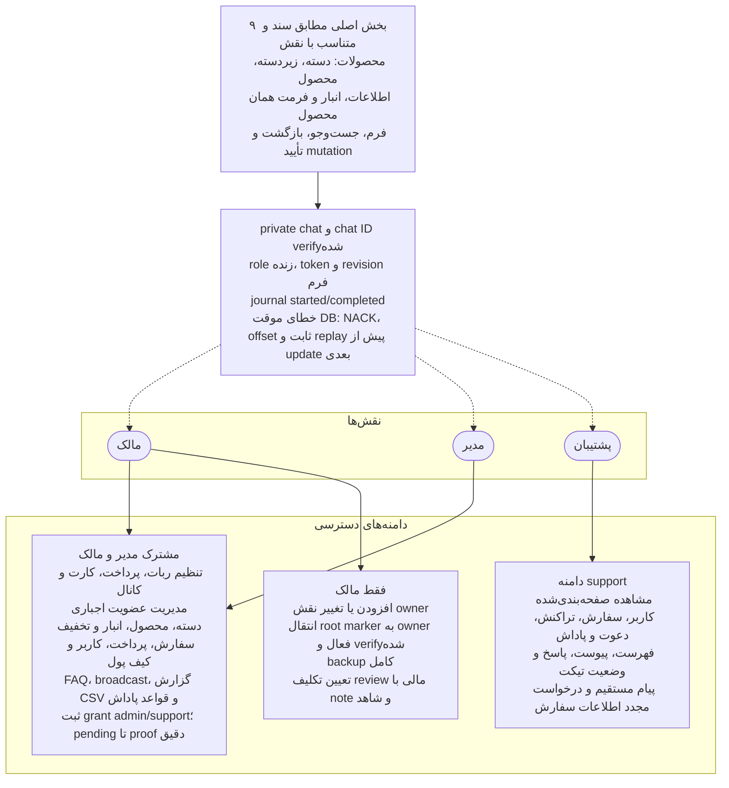
```mermaid
flowchart TB
    subgraph Actors["نقش‌ها"]
        direction LR
        Owner(["مالک"])
        Admin(["مدیر"])
        Support(["پشتیبان"])
    end

    subgraph Scopes["دامنه‌های دسترسی"]
        direction LR
        Shared["مشترک مدیر و مالک<br/>تنظیم ربات، پرداخت، کارت و کانال<br/>مدیریت عضویت اجباری<br/>دسته، محصول، انبار و تخفیف<br/>سفارش، پرداخت، کاربر و کیف پول<br/>FAQ، broadcast، گزارش CSV و قواعد پاداش<br/>ثبت grant admin/support؛ pending تا proof دقیق"]
        SupportScope["دامنه support<br/>مشاهده صفحه‌بندی‌شده کاربر، سفارش، تراکنش، دعوت و پاداش<br/>فهرست، پیوست، پاسخ و وضعیت تیکت<br/>پیام مستقیم و درخواست مجدد اطلاعات سفارش"]
        OwnerOnly["فقط مالک<br/>افزودن یا تغییر نقش owner<br/>انتقال root marker به owner فعال و verifyشده<br/>backup کامل<br/>تعیین تکلیف review مالی با note و شاهد"]
    end

    Owner --> Shared
    Admin --> Shared
    Support --> SupportScope
    Owner --> OwnerOnly

    Panel["۹ بخش اصلی مطابق سند و متناسب با نقش<br/>محصولات: دسته، زیردسته، محصول<br/>اطلاعات، انبار و فرمت همان محصول<br/>فرم، جست‌وجو، بازگشت و تأیید mutation"]
    Guard["private chat و chat ID verifyشده<br/>role زنده، token و revision فرم<br/>journal started/completed<br/>خطای موقت DB: NACK، offset ثابت و replay پیش از update بعدی"]
    Panel --> Guard
    Guard -.-> Owner
    Guard -.-> Admin
    Guard -.-> Support
```

## ۷. Activity عضویت اجباری و onboarding

مدیران فعال از guard عمومی عبور می‌کنند. برای کاربران عادی، خطای بررسی عضویت fail-closed است. referral ممکن است زودتر ثبت شود، اما پاداش start فقط بعد از عبور موفق از guard اعمال می‌شود.

[منبع Mermaid](diagrams/07-activity-onboarding-forced-join.mmd) · [خروجی SVG](diagrams/rendered/07-activity-onboarding-forced-join.svg)

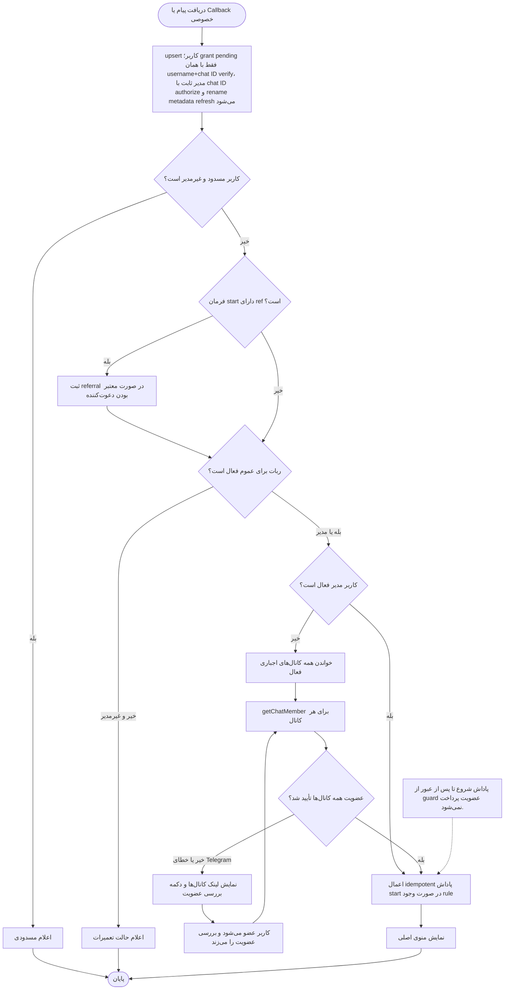
```mermaid
flowchart TD
    A(["دریافت پیام یا Callback خصوصی"])
    B["upsert کاربر؛ grant pending فقط با همان username+chat ID verify، مدیر ثابت با chat ID authorize و rename metadata refresh می‌شود"]
    C{"کاربر مسدود و غیرمدیر است؟"}
    D["اعلام مسدودی"]
    E{"فرمان start دارای ref است؟"}
    F["ثبت referral در صورت معتبر بودن دعوت‌کننده"]
    G{"ربات برای عموم فعال است؟"}
    H["اعلام حالت تعمیرات"]
    I{"کاربر مدیر فعال است؟"}
    J["خواندن همه کانال‌های اجباری فعال"]
    K["getChatMember برای هر کانال"]
    L{"عضویت همه کانال‌ها تأیید شد؟"}
    M["نمایش لینک کانال‌ها و دکمه بررسی عضویت"]
    N["کاربر عضو می‌شود و بررسی عضویت را می‌زند"]
    O["اعمال idempotent پاداش start در صورت وجود rule"]
    P["نمایش منوی اصلی"]
    Z(["پایان"])

    A --> B --> C
    C -->|"بله"| D --> Z
    C -->|"خیر"| E
    E -->|"بله"| F --> G
    E -->|"خیر"| G
    G -->|"خیر و غیرمدیر"| H --> Z
    G -->|"بله یا مدیر"| I
    I -->|"بله"| O
    I -->|"خیر"| J --> K --> L
    L -->|"خیر یا خطای Telegram"| M --> N --> K
    L -->|"بله"| O
    O --> P --> Z

    Safe["پاداش شروع تا پس از عبور از guard عضویت پرداخت نمی‌شود."]
    Safe -.-> O
```

## ۸. Activity خرید محصول آماده

موجودی واقعی در لحظهٔ تحویل دوباره بررسی می‌شود؛ بنابراین race مصرف آخرین item به مسیر رزرو یا وضعیت `processing` برای restock منتقل می‌شود و پول کاربر در وضعیت نامشخص رها نمی‌شود. renderer واقعی پیام تحویل نیز پیش از assignment کنترل می‌شود و خروجی بیش از ۳۹۰۰ نویسه بدون تغییر inventory یا سفارش رد می‌شود. پس از افزودن موجودی، worker هم reservationهای FIFO و هم قدیمی‌ترین سفارش‌های ready در `processing` را به‌صورت bounded fulfil می‌کند؛ `/inventory_assign` مستقیم در حضور backlog ready همان محصول conflict است تا صف قدیمی دور زده نشود. گره «تأمین دستی» در نمودار به اقدام اپراتور برای restock اشاره دارد، نه تکمیل دستی سفارش.

[منبع Mermaid](diagrams/08-activity-ready-purchase.mmd) · [خروجی SVG](diagrams/rendered/08-activity-ready-purchase.svg)

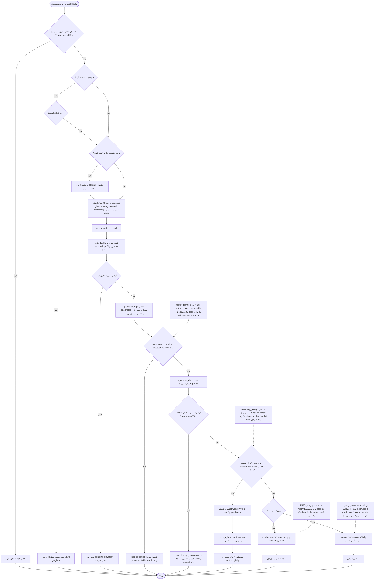
```mermaid
flowchart TD
    A(["انتخاب خرید محصول ready"])
    B{"محصول فعال، قابل مشاهده و قابل خرید است؟"}
    C["اعلام عدم امکان خرید"]
    D{"موجودی آماده دارد؟"}
    E{"رزرو فعال است؟"}
    F["اعلام ناموجودی پیش از ایجاد سفارش"]
    G{"نام و شماره کاربر ثبت شده؟"}
    H["دریافت نام و contact متعلق به همان کاربر"]
    I["ایجاد اتمیک Order، snapshot و خلاصه پایدار created-summary؛ سپس پاک‌کردن state"]
    J["اعمال اختیاری تخفیف"]
    K["تأیید صریح پرداخت؛ حتی محصول رایگان یا تخفیف صددرصد"]
    L{"تأیید و تسویه کامل شد؟"}
    M["سفارش pending_payment باقی می‌ماند"]
    L0["queue/attempt اعلان canonical شماره سفارش، محصول، مبلغ و روش"]
    L1{"اعلان sent یا terminal failed/cancelled است؟"}
    L2["queued/sending؛ تعویق همه شاخه‌های fulfillment تا retry"]
    N["اعمال پاداش‌های خرید به‌صورت idempotent"]
    O0{"render نهایی تحویل حداکثر ۳۹۰۰ نویسه است؟"}
    O1["رد پیش از تغییر inventory یا سفارش؛ اصلاح payload یا instructions"]
    O{"نوبت FIFO پرداخت و assign_inventory مجاز است؟"}
    P["اتصال اتمیک inventory item به سفارش و کاربر"]
    Q["تکمیل سفارش، ثبت payload و شروع مدت اشتراک"]
    R["صف‌کردن پیام تحویل در outbox پایدار"]
    S{"رزرو فعال است؟"}
    T["ساخت reservation و وضعیت awaiting_stock"]
    U["اعلام انتظار موجودی"]
    V["وضعیت processing و اعلام نیاز به تأمین دستی"]
    W["اطلاع به مدیر"]
    X(["پایان"])

    A --> B
    B -->|"خیر"| C --> X
    B -->|"بله"| D
    D -->|"خیر"| E
    E -->|"خیر"| F --> X
    E -->|"بله"| G
    D -->|"بله"| G
    G -->|"خیر"| H --> I
    G -->|"بله"| I
    I --> J --> K --> L
    L -->|"خیر"| M --> X
    L -->|"بله"| L0 --> L1
    L1 -->|"خیر"| L2 --> X
    L1 -->|"بله"| N --> O0
    O0 -->|"خیر"| O1 --> X
    O0 -->|"بله"| O
    O -->|"بله"| P --> Q --> R --> X
    O -->|"خیر"| S
    S -->|"بله"| T --> U --> X
    S -->|"خیر"| V --> W --> X

    Later["FIFO همه سفارش‌های ready پرداخت‌شده؛ paid_at دقیق، نه ترتیب ایجاد سفارش یا صف"]
    Later -.-> T
    LaterProcessing["پرداخت‌شدهٔ قدیمی‌تر حتی پیش از ساخت reservation مقدم است؛ خرید تازه و cap چرخه صف را دور نمی‌زنند"]
    LaterProcessing -.-> V
    Direct["/inventory_assign مستقیم فقط بدون backlog ready همان محصول؛ وگرنه conflict برای حفظ FIFO"]
    Direct -.-> O
    Terminal["failure terminal اعلان در outbox قابل مشاهده است ولی سفارش paid را برای همیشه متوقف نمی‌کند"]
    Terminal -.-> L1
```

## ۹. Activity خرید محصول دستی

تاریخ شروع اشتراک manual زمان تکمیل واقعی است، نه زمان پرداخت و نه زمان دریافت اطلاعات. attachment کاربر با metadata پایدار ذخیره و اعلان owner/admin با hash نسخه محتوا ساخته می‌شود؛ خروجی نهایی `/complete` نیز باید در یک پیام حداکثر ۳۹۰۰ نویسه جا شود وگرنه سفارش پیش از mutation در `processing` می‌ماند.

[منبع Mermaid](diagrams/09-activity-manual-purchase.mmd) · [خروجی SVG](diagrams/rendered/09-activity-manual-purchase.svg)

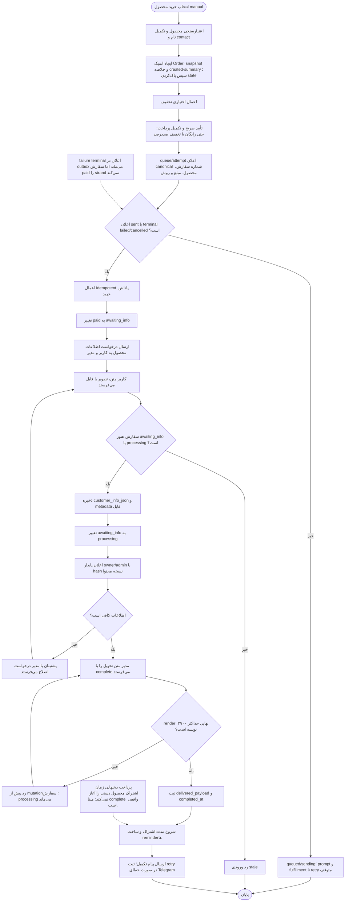
```mermaid
flowchart TD
    A(["انتخاب خرید محصول manual"])
    B["اعتبارسنجی محصول و تکمیل نام و contact"]
    C["ایجاد اتمیک Order، snapshot و خلاصه created-summary؛ سپس پاک‌کردن state"]
    D["اعمال اختیاری تخفیف"]
    E["تأیید صریح و تکمیل پرداخت؛ حتی رایگان یا تخفیف صددرصد"]
    E0["queue/attempt اعلان canonical شماره سفارش، محصول، مبلغ و روش"]
    E1{"اعلان sent یا terminal failed/cancelled است؟"}
    E2["queued/sending؛ prompt و fulfillment تا retry متوقف"]
    F["اعمال idempotent پاداش خرید"]
    G["تغییر paid به awaiting_info"]
    H["ارسال درخواست اطلاعات محصول به کاربر و مدیر"]
    I["کاربر متن، تصویر یا فایل می‌فرستد"]
    J{"سفارش هنوز awaiting_info یا processing است؟"}
    K["رد ورودی stale"]
    L["ذخیره customer_info_json و metadata فایل"]
    M["تغییر awaiting_info به processing"]
    N["اعلان پایدار owner/admin با hash نسخه محتوا"]
    O{"اطلاعات کافی است؟"}
    P["پشتیبان یا مدیر درخواست اصلاح می‌فرستد"]
    Q["مدیر متن تحویل را با complete می‌فرستد"]
    Q0{"render نهایی حداکثر ۳۹۰۰ نویسه است؟"}
    Q1["رد پیش از mutation؛ سفارش processing می‌ماند"]
    R["ثبت delivered_payload و completed_at"]
    S["شروع مدت اشتراک و ساخت reminderها"]
    T["ارسال پیام تکمیل؛ ثبت retry در صورت خطای Telegram"]
    Z(["پایان"])

    A --> B --> C --> D --> E --> E0 --> E1
    E1 -->|"خیر"| E2 --> Z
    E1 -->|"بله"| F --> G --> H --> I --> J
    J -->|"خیر"| K --> Z
    J -->|"بله"| L --> M --> N --> O
    O -->|"خیر"| P --> I
    O -->|"بله"| Q --> Q0
    Q0 -->|"خیر"| Q1 --> Q
    Q0 -->|"بله"| R --> S --> T --> Z

    Rule["پرداخت به‌تنهایی زمان اشتراک محصول دستی را آغاز نمی‌کند؛ مبنا complete واقعی است."]
    Rule -.-> S
    Terminal["failure terminal اعلان در outbox می‌ماند اما سفارش paid را strand نمی‌کند"]
    Terminal -.-> E1
```

## ۱۰. Activity پرداخت کیف پول، کارت و ارز

هم سفارش و هم شارژ کیف پول از رکورد `payments` استفاده می‌کنند؛ تفاوت با `purpose` مشخص می‌شود. برای سفارش، کیف پول می‌تواند بخشی از مبلغ را hold کند و باقی‌مانده با کارت یا ارز پرداخت شود. روش بیرونی فقط وقتی در startup و setting همان روش آماده باشد دیده و پذیرفته می‌شود. هر سفارش فقط یک external intent فعال هم‌زمان و هر user در مجموع card/crypto فقط یک topup تازه فعال دارد؛ replay فقط method/amount/terms یکسان را می‌پذیرد و intent متفاوت conflict است. داده legacy dual-active در wallet جداگانه قابل resume می‌ماند، اما intent دوم تازه ساخته نمی‌شود. uniqueness مبلغ فقط card است. برای Order/topup ارزی، Payment provisional و terms پیش از تماس شبکه commit می‌شود؛ provider با `payment_number` و `return_existing=1` همان invoice را برمی‌گرداند و ID/URL فقط اتمیک attach می‌شود. invoice crypto صادرشده محلی لغو/expire نمی‌شود و Order/Wallet آن را فقط با URL امن ذخیره‌شده resume می‌کنند؛ receipt فقط card است. نتیجه مالی ابتدا durable evidence می‌شود و partial/unknown/mismatch به review می‌رود. completed دیررس یک Order terminal فقط اعتبار جبرانی کیف پول است، Order را احیا نمی‌کند و فروش `external_paid` محسوب نمی‌شود. تغییر روش پس از لغو card به سفارش تازه نیاز دارد.

[منبع Mermaid](diagrams/10-activity-payment-options.mmd) · [خروجی SVG](diagrams/rendered/10-activity-payment-options.svg)

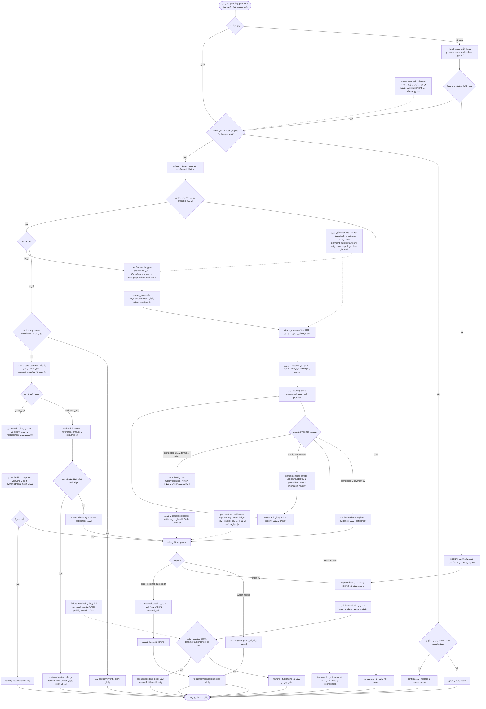
```mermaid
flowchart TD
    A(["سفارش pending_payment یا درخواست شارژ کیف پول"])
    B{"نوع عملیات"}
    C["پس از تأیید صریح کاربر: محاسبه بدهی، تخفیف و hold کیف پول"]
    D{"بدهی کاملاً پوشش داده شد؟"}
    E["capture کیف پول یا تأیید صفرمبلغ؛ ثبت پرداخت کامل"]
    F{"intent فعال Order یا topup کاربر وجود دارد؟"}
    F1{"روش، مبلغ و terms دقیقاً یکسان است؟"}
    F2["بازیابی همان intent"]
    F3["conflict؛ بدون replace یا cancel ضمنی"]
    G["فهرست روش‌های بیرونی configured و فعال"]
    G1{"روش انتخاب‌شده هنوز available است؟"}
    G2["مخفی یا رد به‌صورت fail closed"]
    H{"روش بیرونی"}

    I{"card rate و cancel cooldown مجاز است؟"}
    I1["ثبت security event و alert پایدار"]
    J["ساخت card payment با مبلغ یکتای فقط کارت و quarantine تاریخچه ۲۴ ساعته"]
    K{"مسیر تأیید کارت"}
    L["callback با secret، reference، amount و occurred_at"]
    M{"رخداد دقیقاً منطبق و در مهلت است؟"}
    M1["ثبت card event تأییدشده و settlement اتمیک"]
    M2["ثبت card review؛ alert و resolve فقط owner، بدون credit خودکار"]
    N["فیش card: نخستین ارسال قبل expiry؛ بررسی و replacement تا تصمیم مدیر"]
    O["ذخیره file kind، payment verifying و alert owner/admin با hash نسخه"]
    P{"تأیید مدیر؟"}
    Q["failed و reconciliation والد"]

    R0["ثبت Payment crypto provisional برای Order/topup و freeze user/purpose/amount/terms"]
    R["create_invoice با payment_number پایدار و return_existing=1"]
    R1["attach اتمیک شناسه و URL امن دقیق به همان Payment"]
    S["نمایش و resume همان URL امن HTTPS؛ بدون receipt یا cancel"]
    T["ابتدا recovery شاهد completed؛ سپس poll provider"]
    U{"هویت و evidence چیست؟"}
    U1["ثبت immutable completed evidence؛ سپس settlement"]
    U2["terminal با crypto amount صفر: ثبت failed و reconciliation"]
    U3["partial/nonzero crypto، unknown، identity یا optional fiat params mismatch: review"]
    U4["alert پایدار؛ ادامه poll یا resolve مستند owner"]
    U5["completed بعد از failed/resolution: review پرخطر؛ Order احیا نمی‌شود"]
    U6["با شاهد completed: topup settle یا اعتبار جبرانی Order terminal"]

    W["اثر مالی idempotent"]
    X{"purpose"}
    Y["ثبت ledger topup و افزایش کیف پول"]
    Y2["ثبت manual_credit جبرانی؛ بدون احیای Order یا external_paid"]
    Z["capture hold و ثبت سهم external فروش سفارش"]
    AA["topup/compensation notice پایدار"]
    AA0["اعلان canonical سفارش: شماره، محصول، مبلغ و روش"]
    AAG{"وضعیت اعلان sent یا terminal failed/cancelled است؟"}
    AAW["queued/sending؛ defer تمام reward/fulfillment تا retry"]
    AA1["reward و fulfillment سفارش پس از gate"]
    AC["اعلان پایدار تصمیم owner"]
    AB(["پایان یا انتظار چرخه بعد"])

    A --> B
    B -->|"سفارش"| C --> D
    D -->|"بله"| E --> Z
    D -->|"خیر"| F
    B -->|"شارژ"| F
    F -->|"بله"| F1
    F1 -->|"بله"| F2 --> AB
    F1 -->|"خیر"| F3 --> AB
    F -->|"خیر"| G --> G1
    G1 -->|"خیر"| G2 --> AB
    G1 -->|"بله"| H
    H -->|"کارت"| I
    I -->|"خیر"| I1 --> AB
    I -->|"بله"| J --> K
    K -->|"callback بانکی"| L --> M
    M -->|"بله"| M1 --> W
    M -->|"خیر"| M2 --> AB
    K -->|"فیش دستی"| N --> O --> P
    P -->|"بله"| W
    P -->|"خیر"| Q --> AB
    H -->|"ارزی"| R0 --> R --> R1 --> S --> T --> U
    U -->|"completed و payment باز"| U1 --> W
    U -->|"terminal-zero"| U2 --> AB
    U -->|"ambiguous/review"| U3 --> U4 --> T
    U -->|"completed پس از terminal محلی"| U5 --> U6 --> W
    W --> X
    X -->|"wallet_topup"| Y --> AA --> AB
    X -->|"order باز"| Z --> AA0 --> AAG
    AAG -->|"بله"| AA1 --> AB
    AAG -->|"خیر"| AAW --> AB
    X -->|"order terminal؛ late credit"| Y2 --> AC --> AA --> AB

    Idem["provider/card evidence، payment key، wallet ledger key و outbox key اثر تکراری را مهار می‌کنند."]
    Idem -.-> W
    Legacy["legacy dual-active topup: هر دو در کیف پول جدا دیده می‌شوند؛ create intent دوم ممنوع می‌ماند."]
    Legacy -.-> F
    CrashSafe["خطای مبهم remote یا crash پیش از attach: provisional حفظ و همان payment_number/amount retry می‌شود؛ poll فقط پس از attach"]
    CrashSafe -.-> R0
    CrashSafe -.-> R1
    Terminal["failure terminal اعلان قابل مشاهده است ولی Order paid را strand نمی‌کند"]
    Terminal -.-> AAG
```

## ۱۱. Activity تیکت پشتیبانی

گفت‌وگو و پیوست‌ها در دیتابیس نگهداری و صفحه‌بندی می‌شوند. `open` یعنی منتظر رسیدگی یا پاسخ تازهٔ کاربر، `answered` یعنی پاسخ مدیریتی ثبت شده و `closed` پیام تازه نمی‌پذیرد. owner/admin/support می‌توانند photo/document را با `/ticket_attachment MESSAGE_ID` و پس از revalidation نقش و entity بازیابی کنند؛ reply/status/close همراه notice پایدار کاربر commit می‌شود.

[منبع Mermaid](diagrams/11-activity-support-ticket.mmd) · [خروجی SVG](diagrams/rendered/11-activity-support-ticket.svg)

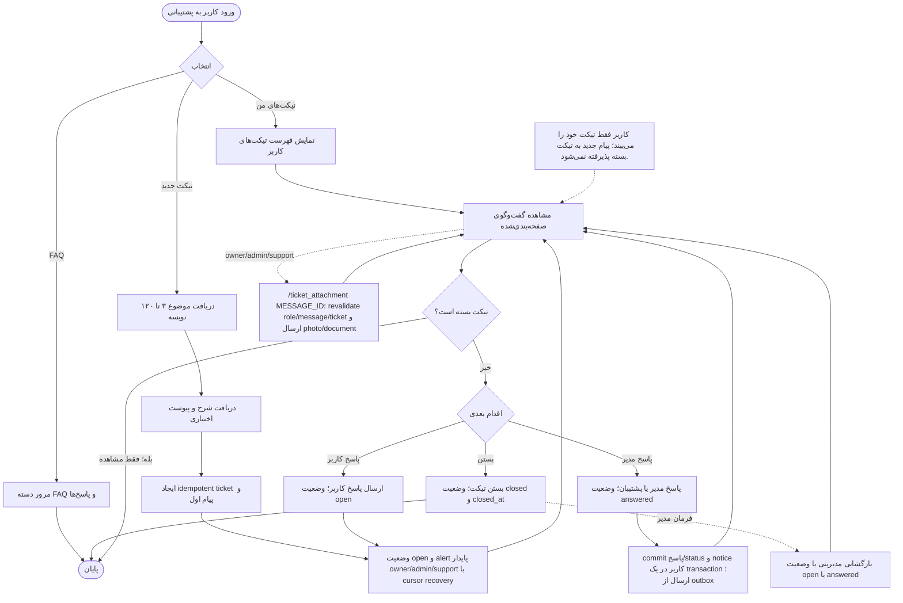
```mermaid
flowchart TD
    A(["ورود کاربر به پشتیبانی"])
    B{"انتخاب"}
    C["مرور دسته FAQ و پاسخ‌ها"]
    D["نمایش فهرست تیکت‌های کاربر"]
    E["دریافت موضوع ۳ تا ۱۲۰ نویسه"]
    F["دریافت شرح و پیوست اختیاری"]
    G["ایجاد idempotent ticket و پیام اول"]
    H["وضعیت open و alert پایدار owner/admin/support با cursor recovery"]
    I["مشاهده گفت‌وگوی صفحه‌بندی‌شده"]
    J{"تیکت بسته است؟"}
    K["ارسال پاسخ کاربر؛ وضعیت open"]
    L["پاسخ مدیر یا پشتیبان؛ وضعیت answered"]
    M["commit پاسخ/status و notice کاربر در یک transaction؛ ارسال از outbox"]
    N{"اقدام بعدی"}
    O["بستن تیکت؛ وضعیت closed و closed_at"]
    P["بازگشایی مدیریتی با وضعیت open یا answered"]
    R["/ticket_attachment MESSAGE_ID؛ revalidate role/message/ticket و ارسال photo/document"]
    Z(["پایان"])

    A --> B
    B -->|"FAQ"| C --> Z
    B -->|"تیکت‌های من"| D --> I
    B -->|"تیکت جدید"| E --> F --> G --> H --> I
    I --> J
    J -->|"خیر"| N
    N -->|"پاسخ کاربر"| K --> H
    N -->|"پاسخ مدیر"| L --> M --> I
    N -->|"بستن"| O --> Z
    J -->|"بله؛ فقط مشاهده"| Z
    O -.->|"فرمان مدیر"| P --> I
    I -.->|"owner/admin/support"| R --> I

    Access["کاربر فقط تیکت خود را می‌بیند؛ پیام جدید به تیکت بسته پذیرفته نمی‌شود."]
    Access -.-> I
```

## ۱۲. Activity دعوت و پاداش

ruleهای `start`، `first_purchase`، `product_purchase` و `combined` پشتیبانی می‌شوند. در combined تمام شرط‌های ثبت‌شده باید هم‌زمان برقرار باشند و شمارش خرید با زمان و ترتیب سفارش منبع سازگار است. هر reward event فاقد notice از روی ledger بازیابی می‌شود و marker پاداش Order هیچ‌گاه selector fulfillment نیست.

[منبع Mermaid](diagrams/12-activity-referral-reward.mmd) · [خروجی SVG](diagrams/rendered/12-activity-referral-reward.svg)

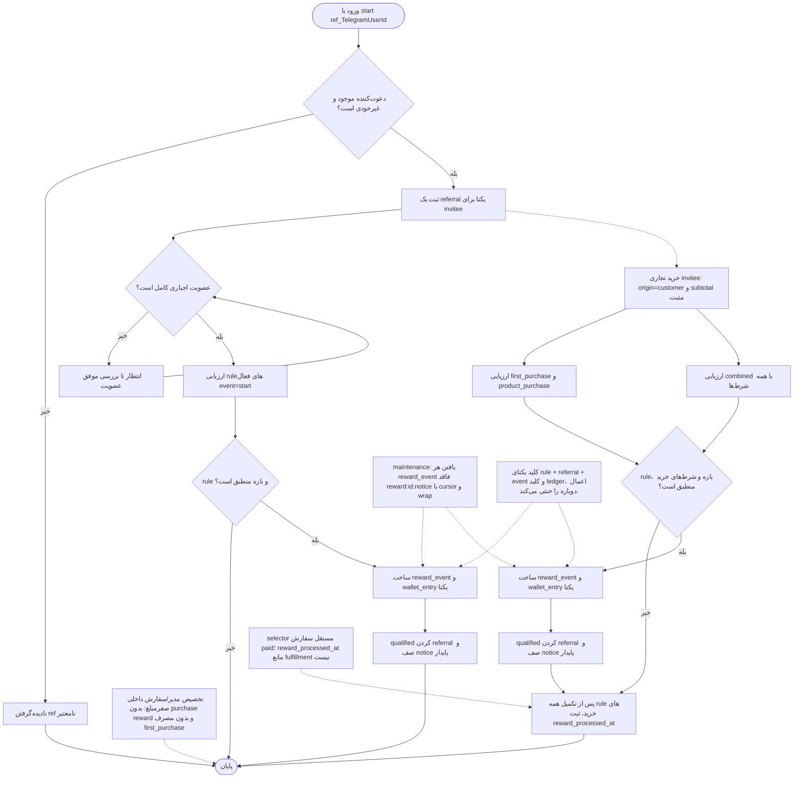
```mermaid
flowchart TD
    A(["ورود با start ref_TelegramUserId"])
    B{"دعوت‌کننده موجود و غیرخودی است؟"}
    C["نادیده‌گرفتن ref نامعتبر"]
    D["ثبت یک referral یکتا برای invitee"]
    E{"عضویت اجباری کامل است؟"}
    F["انتظار تا بررسی موفق عضویت"]

    G["ارزیابی ruleهای فعال event=start"]
    GS{"rule و بازه منطبق است؟"}
    GR["ساخت reward_event و wallet_entry یکتا"]
    GN["qualified کردن referral و صف notice پایدار"]

    H["خرید تجاری invitee: origin=customer و subtotal مثبت"]
    HX["تخصیص مدیر/سفارش داخلی صفرمبلغ: بدون purchase reward و بدون مصرف first_purchase"]
    I["ارزیابی first_purchase و product_purchase"]
    J["ارزیابی combined با همه شرط‌ها"]
    K{"rule، بازه و شرط‌های خرید منطبق است؟"}
    L["ساخت reward_event و wallet_entry یکتا"]
    M["qualified کردن referral و صف notice پایدار"]
    P["پس از تکمیل همه ruleهای خرید، ثبت reward_processed_at"]
    R["maintenance: یافتن هر reward_event فاقد reward:id:notice با cursor و wrap"]
    S["selector مستقل سفارش paid؛ reward_processed_at مانع fulfillment نیست"]
    Q(["پایان"])

    A --> B
    B -->|"خیر"| C --> Q
    B -->|"بله"| D --> E
    E -->|"خیر"| F --> E
    E -->|"بله"| G --> GS
    GS -->|"خیر"| Q
    GS -->|"بله"| GR --> GN --> Q

    D -.-> H
    HX -.-> Q
    H --> I --> K
    H --> J --> K
    K -->|"خیر"| P
    K -->|"بله"| L --> M --> P --> Q

    Exact["کلید یکتای rule + referral + event و کلید ledger، اعمال دوباره را خنثی می‌کند."]
    Exact -.-> GR
    Exact -.-> L
    R -.-> GR
    R -.-> L
    S -.-> P
```

## ۱۳. State machine سفارش

این نمودار lifecycle بیزنسی را نشان می‌دهد و مسیرهای تخصصی پرداخت/fulfillment را کنار transitionهای عمومی قرار می‌دهد. `paid` و `completed` فقط از workflow تخصصی می‌آیند؛ `refunded` در schema رزرو است اما نسخه فعلی هیچ workflow ورود به آن ندارد.

[منبع Mermaid](diagrams/13-order-state-machine.mmd) · [خروجی SVG](diagrams/rendered/13-order-state-machine.svg)

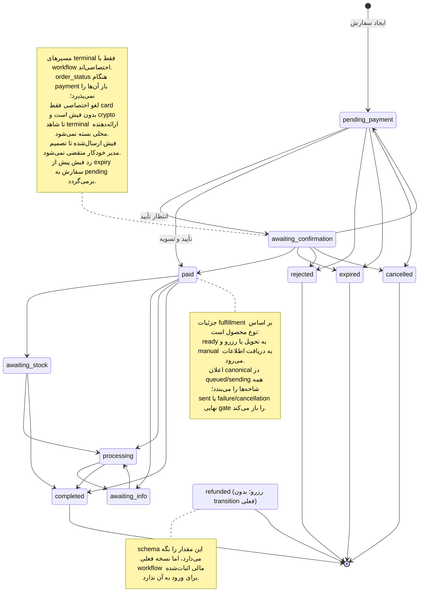
```mermaid
stateDiagram-v2
    [*] --> PendingPayment: ایجاد سفارش

    state "pending_payment" as PendingPayment
    state "awaiting_confirmation" as AwaitingConfirmation
    state "paid" as Paid
    state "awaiting_stock" as AwaitingStock
    state "awaiting_info" as AwaitingInfo
    state "processing" as Processing
    state "completed" as Completed
    state "rejected" as Rejected
    state "expired" as Expired
    state "cancelled" as Cancelled
    state "refunded (رزرو؛ بدون transition فعلی)" as Refunded

    PendingPayment --> AwaitingConfirmation: انتظار تأیید
    PendingPayment --> Paid: تأیید و تسویه
    PendingPayment --> Rejected
    PendingPayment --> Expired
    PendingPayment --> Cancelled

    AwaitingConfirmation --> Paid
    AwaitingConfirmation --> PendingPayment
    AwaitingConfirmation --> Expired
    AwaitingConfirmation --> Rejected
    AwaitingConfirmation --> Cancelled

    Paid --> AwaitingStock
    Paid --> AwaitingInfo
    Paid --> Processing
    Paid --> Completed

    AwaitingStock --> Processing
    AwaitingStock --> Completed

    AwaitingInfo --> Processing

    Processing --> AwaitingInfo
    Processing --> Completed

    note right of Refunded
        schema این مقدار را نگه می‌دارد، اما نسخه فعلی
        workflow مالی اثبات‌شده برای ورود به آن ندارد.
    end note

    note left of AwaitingConfirmation
        مسیرهای terminal فقط با workflow اختصاصی‌اند.
        order_status هنگام payment باز آن‌ها را نمی‌پذیرد؛
        لغو اختصاصی فقط card بدون فیش است و crypto
        تا شاهد terminal ارائه‌دهنده محلی بسته نمی‌شود.
        فیش ارسال‌شده تا تصمیم مدیر خودکار منقضی نمی‌شود.
        رد فیش پیش از expiry سفارش به pending برمی‌گردد.
    end note

    note right of Paid
        جزئیات fulfillment بر اساس نوع محصول است:
        ready به تحویل یا رزرو و manual به دریافت اطلاعات می‌رود.
        اعلان canonical در queued/sending همه شاخه‌ها را می‌بندد؛
        sent یا failure/cancellation نهایی gate را باز می‌کند.
    end note

    Expired --> [*]
    Cancelled --> [*]
    Refunded --> [*]
    Completed --> [*]
    Rejected --> [*]
```

## ۱۴. Sequence پرداخت و تحویل

ترتیب commitهای حیاتی را از guard پیکربندی روش و ساخت intent پرداخت تا outbox نشان می‌دهد. اعلان شبکه‌ای ناموفق نباید بتواند mutation پرداخت، attachment، سفارش، reward یا fulfillment را بدون رکورد durable و مسیر بازیابی رها کند.

[منبع Mermaid](diagrams/14-payment-fulfillment-sequence.mmd) · [خروجی SVG](diagrams/rendered/14-payment-fulfillment-sequence.svg)

```mermaid
%%{init: {"sequence": {"mirrorActors": false}}}%%
sequenceDiagram
    autonumber
    actor User as کاربر
    participant TG as Telegram Bot API
    participant Bot as BotApplication
    participant DB as Database و SQLite
    participant Pay as بانک یا Plisio
    participant Worker as Maintenance Worker
    actor Admin as مدیر

    User->>TG: انتخاب خرید یا شارژ و روش پرداخت
    TG->>Bot: message یا callback_query
    Bot->>Bot: کنترل setting و config روش؛ روش ناقص fail closed
    Bot->>DB: create_order با created-summary اتمیک؛ سپس create_payment با idempotency key
    Note over Bot,DB: state first-contact فقط پس از commit Order و order:id:created-summary پاک می‌شود
    DB->>DB: enforce یک intent هر Order و یک topup تازه هر user در مجموع card/crypto
    DB-->>Bot: همان intent فقط در replay روش/مبلغ/terms یکسان؛ وگرنه conflict
    Bot-->>TG: card فقط receipt؛ crypto با URL امن قابل resume و بدون cancel/expiry محلی
    Note over Bot,DB: legacy dual-active topup هر دو جدا نمایش داده می‌شوند، اما intent دوم تازه ساخته نمی‌شود
    Note over Bot,DB: uniqueness مبلغ و quarantine ۲۴ ساعته فقط برای card است

    alt callback خودکار کارت
        Pay->>Bot: reference، amount و occurred_at با secret
        Bot->>DB: ثبت card event و settlement در یک transaction
        alt رخداد منطبق
            DB-->>Bot: payment paid
        else رخداد دیررس یا نامنطبق
            DB-->>Bot: review بدون credit
            Bot->>DB: queue alert مدیران
            Admin->>Bot: card_resolve با note؛ بدون credit خودکار
        end
    else poll Plisio
        Bot->>DB: پیش از network ثبت/reuse Payment provisional و freeze terms
        Bot->>Pay: create_invoice با payment_number پایدار و return_existing=1
        Pay-->>Bot: invoice id و URL
        Bot->>DB: attach اتمیک invoice دقیق؛ provisional ناقص poll نمی‌شود
        Worker->>Bot: ابتدا reconcile completed evidence سپس poll
        Bot->>Pay: operation(invoice_id)
        Pay-->>Bot: status، id/type، crypto amount و optional fiat params
        Bot->>DB: commit immutable provider event با payload hash
        alt completed و payment باز
            Bot->>DB: settlement از شاهد durable
        else terminal با crypto amount صفر
            DB->>DB: failed و reconciliation parent
        else partial/unknown، identity یا optional fiat mismatch
            DB->>DB: verifying و review quarantine
            Bot->>DB: queue alert مدیران
            Note over Bot,Worker: poll ادامه دارد؛ completed/zero بعدی review را با event تازه حل می‌کند
        else completed پس از resolution یا failed
            DB->>DB: review پرخطر تازه؛ Order احیا نمی‌شود
            Admin->>Bot: crypto_resolve فقط با شاهد completed دقیق
            Bot->>DB: topup settle یا اعتبار جبرانی کیف پول، نه revenue Order
        end
        Note over DB,Worker: crash پس از ثبت completed evidence در run بعد بدون network بازیابی می‌شود
    else تأیید فیش دستی
        User->>TG: فیش card؛ نخستین قبل expiry یا replacement تا تصمیم مدیر
        TG->>Bot: photo/document با file_id
        Bot->>DB: submit receipt با file kind و status verifying
        Bot->>DB: queue alert پایدار owner/admin با hash نسخه فیش
        Admin->>Bot: payment_detail سپس approve/reject
        Bot->>DB: settlement یا failed/reconcile
    else کیف پول کافی
        Bot->>DB: wallet hold و capture اتمیک
    else محصول رایگان یا تخفیف صددرصد
        User->>TG: تأیید صریح پرداخت در خلاصه سفارش
        Bot->>DB: confirm_zero_payable_order اتمیک و idempotent
    end

    opt payment به paid رسیده است
        Bot->>DB: queue notice با کلید ثابت
        Worker->>DB: recover هر paid payment فاقد notice پس از crash
    end

    opt موفقیت بدون external payment
        Worker->>DB: recover wallet/discount/free-confirmed فاقد outbox با cursor/wrap
    end

    DB-->>Bot: order paid، topup credited یا terminal compensation
    opt purpose سفارش و order paid
        Bot->>DB: queue اعلان canonical شماره/محصول/مبلغ/روش
        Bot->>TG: attempt اعلان موفقیت
        TG-->>Bot: message_id یا خطای retryable/terminal
        Bot->>DB: status sent، queued/sending یا failed/cancelled
        Worker->>DB: recover missing notice و retry با cursor
        Bot->>DB: order_success_notice_ready
        alt queued یا sending
            DB-->>Bot: defer همه شاخه‌های fulfillment تا retry
        else sent یا terminal failed/cancelled
            DB-->>Bot: gate باز؛ failure terminal در outbox قابل مشاهده می‌ماند
        end
        Bot->>DB: grant_purchase_rewards
        DB->>DB: reward event و wallet ledger یکتا
        Bot->>DB: queue reward notice؛ سپس mark reward_processed_at
        Worker->>DB: recover هر reward event فاقد notice با cursor/wrap
        Worker->>DB: selector مستقل status=paid برای fulfillment؛ marker پاداش شرط نیست

        alt محصول آماده و موجود
            Bot->>DB: validate render حداکثر ۳۹۰۰ و FIFO پرداخت؛ سپس assign و queue delivery اتمیک
            DB->>DB: assign item و complete order
            Note over Admin,DB: inventory_assign مستقیم فقط وقتی backlog ready همان محصول خالی است؛ وگرنه FIFO مقدم است
        else محصول آماده و قابل رزرو
            Bot->>DB: reserve_product
            DB-->>Bot: order awaiting_stock
            Worker->>DB: fulfill_next_reservation پس از شارژ انبار
            Worker->>DB: queue delivery با کلید ثابت
        else محصول دستی
            Bot->>DB: status awaiting_info
            Bot-->>User: درخواست اطلاعات
            User->>Bot: متن یا فایل فعال‌سازی
            Bot->>DB: ذخیره اطلاعات، status processing و alert نسخه‌بندی‌شده در workflow اتمیک
            Admin->>Bot: مشاهده attachment و complete order
            Bot->>DB: validate render حداکثر ۳۹۰۰؛ سپس completed، outbox و reminder
        end
        opt سفارش ready در processing پس از race موجودی
            Worker->>DB: recover alert پایدار user و owner/admin از state processing
            Worker->>DB: انتخاب قدیمی‌ترین order واجد stock فقط بدون reservation معتبر قدیمی‌تر همان محصول
            Note over DB,Worker: cap fulfil رزرو مجوز دورزدن FIFO نیست
        end
    end

    Worker->>DB: claim outbound message
    Worker->>TG: sendMessage/sendDocument/sendPhoto
    TG-->>Worker: message_id یا خطا
    Worker->>DB: sent یا retry با backoff
```

## ۱۵. Crash و reward reconciliation

Maintenance پیش از sweep محلی، completed evidence ثبت‌شده را بدون network settle و سپس crypto را poll می‌کند؛ review/attachment/security/no-stock alert، هر reward event فاقد notice و paid notice جاافتاده نیز durable بازسازی می‌شوند. فقط سفارش‌های موفق دارای marker خالی برای reward scan می‌شوند و snapshot پیش از پردازش گرفته می‌شود تا کوچک‌شدن query هنگام ثبت marker باعث جاافتادن ردیف‌ها نشود. یک selector جداگانه همه سفارش‌های status=`paid` را مستقل از `reward_processed_at` برای fulfillment می‌یابد. تحویل آماده، prompt اطلاعات، reservation، سفارش ready در `processing`، reminder معتبر و پیام‌های پایدار نیز مستقل بازسازی می‌شوند.

[منبع Mermaid](diagrams/15-crash-reward-reconciliation.mmd) · [خروجی SVG](diagrams/rendered/15-crash-reward-reconciliation.svg)

```mermaid
flowchart TD
    A(["هر اجرای maintenance"])
    B["reconcile completed provider evidence ثبت‌شده؛ بدون network"]
    C["poll crypto باز یا failed قابل‌پایش؛ ثبت immutable evidence"]
    C1["completed/terminal-zero بعدی review باز را با رخداد تازه حل می‌کند"]
    C2["partial، unknown، mismatch یا completed پس از resolution: review پرخطر"]
    D["reconcile alert و notice تصمیم provider/card review، فیش، اطلاعات manual، ticket و security"]
    D1["reconcile alert no-stock و هر reward_event فاقد notice با cursor/wrap"]
    E0["expire unpaid/card بدون فیش؛ فیش تا تصمیم مدیر و crypto تا نتیجه provider باز است"]
    E1["reconcile هشدار پایدار شارژ کیف پول منقضی: دیگر پرداخت نکنید"]
    M2["reconcile paid payment notice فاقد outbox"]
    M3["reconcile wallet/discount/free-confirmed notice فاقد outbox با cursor/wrap"]
    M4{"order_success_notice_ready؟"}
    M5["queued/sending: defer همه شاخه‌های fulfillment"]
    M6["sent یا terminal failed/cancelled: اجازه ادامه"]
    D0["گرفتن snapshot سفارش‌های موفق با reward_processed_at تهی"]
    E{"وضعیت سفارش paid است؟"}
    F["اجرای after_order_paid"]
    G["اجرای reconcile_purchase_rewards"]
    H["grant_purchase_rewards با event و ledger یکتا"]
    I["صف‌کردن notice هر پاداش با idempotency key ثابت"]
    J{"notice ارسال یا به‌درستی در outbox ثبت شد؟"}
    K["reward_processed_at همچنان تهی؛ تلاش در دور بعد"]
    L["mark_order_rewards_processed"]
    M0["selector مستقل همه سفارش‌های status=paid؛ مستقل از reward_processed_at"]
    M["تلاش idempotent برای fulfillment ready/manual"]
    N["بازسازی noticeهای awaiting_stock و awaiting_info"]
    O["تکمیل موجودی با FIFO همه سفارش‌های پرداخت‌شده؛ حتی قبل از ساخت reservation"]
    O2["fulfil سفارش ready در processing پس از restock"]
    P["بازسازی delivery سفارش ready تکمیل‌شده"]
    Q["claim reminder؛ زمان پایان دقیق و روز صفر در TIMEZONE؛ لغو منقضی"]
    Q2["outbox مالک retry؛ claim تک‌پیام و بازبینی انقضا پیش از ارسال reminder"]
    R{"ارسال موفق است؟"}
    S["ثبت sent و telegram_message_id"]
    T{"خطا دائمی است؟"}
    U["ثبت failed نهایی"]
    V["بازگرداندن به queued با backoff"]
    Z(["دور maintenance تمام شد"])

    A --> B --> C
    C --> C1 --> D
    C --> C2 --> D
    C -->|"pending یا network failure"| D
    D --> D1 --> E0 --> E1 --> M2 --> M3 --> M4
    M4 -->|"خیر"| M5 --> Q2
    M4 -->|"بله"| M6 --> D0 --> E
    E -->|"بله"| F --> H
    E -->|"خیر؛ ولی وضعیت موفق"| G --> H
    H --> I --> J
    J -->|"خیر"| K --> M0
    J -->|"بله"| L --> M0
    M0 --> M --> N
    N --> O --> O2 --> P --> Q --> Q2 --> R
    R -->|"بله"| S --> Z
    R -->|"خیر"| T
    T -->|"بله"| U --> Z
    T -->|"خیر"| V --> Z

    Crash["Crash پس از provider evidence یا هر commit مجاز است: ledger immutable، تراکنش DB، کلیدهای idempotency، outbox و marker کار را بازیابی می‌کنند."]
    Crash -.-> B
    Crash -.-> H
    Crash -.-> D1
    Crash -.-> M0
    Crash -.-> Q2
    Created["Order و created-summary از first-contact اتمیک‌اند؛ replay همان update Order دوم نمی‌سازد"]
    Created -.-> A
```

## ۱۶. فرم دکمه‌ای مدیریت و مرز تأیید

منبع: [16-admin-button-form.mmd](diagrams/16-admin-button-form.mmd)



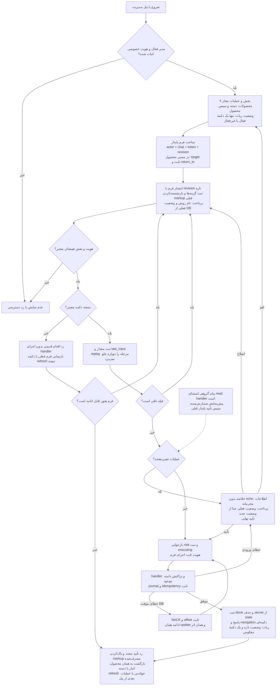
```mermaid
flowchart TB
    A["شروع یا پنل مدیریت"] --> G{"مدیر فعال و هویت خصوصی اثبات شده؟"}
    G -- خیر --> Deny["عدم نمایش یا رد دسترسی"]
    G -- بله --> B["۹ بخش و عملیات مجاز<br/>محصولات: دسته و سپس محصول<br/>وضعیت ربات: تنها یک دکمهٔ فعال یا غیرفعال"]
    B --> C["ساخت فرم پایدار<br/>actor + chat + token + revision<br/>در مسیر محصول: target ثابت و return_to"]
    C --> D["انتشار فرم با revision تازه<br/>ثبت گزینه‌ها و بازنشسته‌کردن markup قبلی<br/>پرداخت: نام روش و وضعیت فعلی از DB"]
    D --> Access{"هویت و نقش همچنان معتبر؟"}
    Access -- خیر --> Deny
    Access -- بله --> V{"نسخه دکمه معتبر؟"}
    V -- خیر --> Stale["رد اقدام قدیمی بدون اجرای handler<br/>بازنمایی فرم فعلی یا دکمه refresh نتیجه"]
    Stale --> Current{"فرم هنوز قابل ادامه است؟"}
    Current -- بله --> D
    Current -- خیر --> Next
    V -- بله --> Save["ثبت مقدار و last_input<br/>replay مرحله را دوباره جلو نمی‌برد"]
    Save --> More{"فیلد باقی است؟"}
    More -- بله --> D
    More -- خیر --> M{"عملیات تغییردهنده؟"}
    M -- بله --> Preview["خلاصه بدون echo اطلاعات محرمانه<br/>پرداخت: وضعیت فعلی جدا از وضعیت جدید<br/>تأیید نهایی"]
    M -- خیر --> Execute
    Preview -- اصلاح --> D
    Preview -- لغو --> B
    Preview -- تأیید --> Execute["بازخوانی role و ثبت executing<br/>هویت ثابت اجرای فرم"]
    Execute --> Domain["handler و تراکنش دامنه موجود<br/>journal و idempotency ثابت"]
    Domain -- خطای موقت DB --> Retry["NACK و offset ثابت<br/>ادامه همان update و همان اثر"]
    Retry --> Execute
    Domain -- خطای ورودی --> Preview
    Domain -- موفق --> Done["ثبت done و حذف secret از state<br/>پاسخ و navigation دکمه‌ای<br/>ربات: وضعیت تازه و یک دکمهٔ معکوس"]
    Done --> Next["رد تأیید مجدد و پاک‌کردن markup مصرف‌شده<br/>بازگشت به همان محصول، انبار یا دسته<br/>refresh خواندنی یا عملیات بعدی از پنل"]
    Broadcast["پیام گروهی استثنای read handler است:<br/>پیش‌نمایش شمارش‌شده، سپس تأیید پایدار قبلی"]
    Broadcast -.-> M
```

## ۱۷. درخت مدیریت محصول و عملیات زمینه‌دار

منبع: [17-admin-catalog-hierarchy.mmd](diagrams/17-admin-catalog-hierarchy.mmd). قرارداد و تست‌ها: [ADMIN_HIERARCHY.md](ADMIN_HIERARCHY.md).



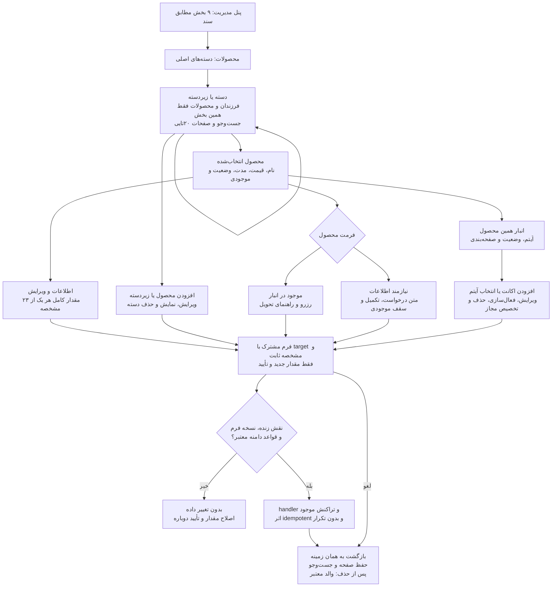
```mermaid
flowchart TB
    Root["پنل مدیریت: ۹ بخش مطابق سند"] --> Products["محصولات: دسته‌های اصلی"]
    Products --> Category["دسته یا زیردسته<br/>فرزندان و محصولات فقط همین بخش<br/>جست‌وجو و صفحات ۲۰تایی"]
    Category --> Category
    Category --> CategoryEdit["افزودن محصول یا زیردسته<br/>ویرایش، نمایش و حذف دسته"]
    Category --> Product["محصول انتخاب‌شده<br/>نام، قیمت، مدت، وضعیت و موجودی"]
    Product --> Fields["اطلاعات و ویرایش<br/>مقدار کامل هر یک از ۲۳ مشخصه"]
    Product --> Stock["انبار همین محصول<br/>آیتم، وضعیت و صفحه‌بندی"]
    Product --> Format{"فرمت محصول"}
    Format --> Ready["موجود در انبار<br/>رزرو و راهنمای تحویل"]
    Format --> Manual["نیازمند اطلاعات<br/>متن درخواست، تکمیل و سقف موجودی"]
    Stock --> Item["افزودن اکانت یا انتخاب آیتم<br/>ویرایش، فعال‌سازی، حذف و تخصیص مجاز"]
    Fields --> Form["فرم مشترک با target و مشخصه ثابت<br/>فقط مقدار جدید و تأیید"]
    CategoryEdit --> Form
    Ready --> Form
    Manual --> Form
    Item --> Form
    Form --> Guard{"نقش زنده، نسخه فرم<br/>و قواعد دامنه معتبر؟"}
    Guard -- خیر --> Error["بدون تغییر داده<br/>اصلاح مقدار و تأیید دوباره"]
    Guard -- بله --> Commit["handler و تراکنش موجود<br/>اثر idempotent و بدون تکرار"]
    Commit --> Back["بازگشت به همان زمینه<br/>حفظ صفحه و جست‌وجو<br/>پس از حذف: والد معتبر"]
    Form -- لغو --> Back
```

## ۱۸. فعالیت مدیریت کانال‌های جوین اجباری

منبع: [18-admin-force-join.mmd](diagrams/18-admin-force-join.mmd). قرارداد و تست‌ها: [ADMIN_JOINS.md](ADMIN_JOINS.md).



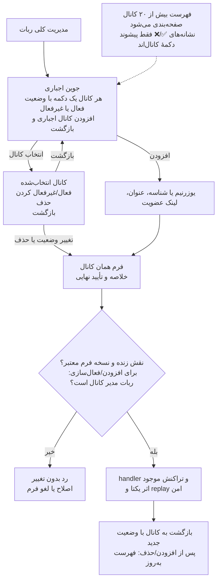
```mermaid
flowchart TB
    Settings["مدیریت کلی ربات"] --> List["جوین اجباری<br/>هر کانال یک دکمه با وضعیت فعال یا غیرفعال<br/>افزودن کانال اجباری و بازگشت"]
    List -- انتخاب کانال --> Channel["کانال انتخاب‌شده<br/>فعال/غیرفعال کردن<br/>حذف<br/>بازگشت"]
    Channel -- بازگشت --> List
    List -- افزودن --> Add["یوزرنیم یا شناسه، عنوان، لینک عضویت"]
    Channel -- تغییر وضعیت یا حذف --> Confirm["فرم همان کانال<br/>خلاصه و تأیید نهایی"]
    Add --> Confirm
    Confirm --> Guard{"نقش زنده و نسخه فرم معتبر؟<br/>برای افزودن/فعال‌سازی: ربات مدیر کانال است؟"}
    Guard -- خیر --> Deny["رد بدون تغییر<br/>اصلاح یا لغو فرم"]
    Guard -- بله --> Effect["handler و تراکنش موجود<br/>اثر یکتا و replay امن"]
    Effect --> Return["بازگشت به کانال با وضعیت جدید<br/>پس از افزودن/حذف: فهرست به‌روز"]
    Note["فهرست بیش از ۲۰ کانال صفحه‌بندی می‌شود<br/>نشانه‌های ✅/❌ فقط پیشوند دکمهٔ کانال‌اند"]
    Note -.-> List
```

## ۱۹. ویرایش و انتشار چیدمان کاربر

چیدمان ۳۹ نوع صفحه با پیش‌نویس، پیش‌نمایش امن، انتشار تأییدشده و واگرد کنترل می‌شود. شرط نمایش و عملیات دکمه ثابت است. [قرارداد کامل](CUSTOMER_LAYOUTS.md).

[منبع Mermaid](diagrams/19-customer-layouts.mmd) · [خروجی SVG](diagrams/rendered/19-customer-layouts.svg)

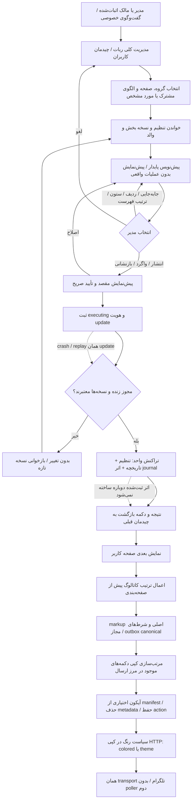
```mermaid
flowchart TB
    A["مدیر یا مالک اثبات‌شده / گفت‌وگوی خصوصی"] --> B["مدیریت کلی ربات / چیدمان کاربران"]
    B --> C["انتخاب گروه، صفحه و الگوی مشترک یا مورد مشخص"]
    C --> D["خواندن تنظیم و نسخه بخش و والد"]
    D --> E["پیش‌نویس پایدار / پیش‌نمایش بدون عملیات واقعی"]
    E --> F{"انتخاب مدیر"}
    F -->|"جابه‌جایی / ردیف / ستون / ترتیب فهرست"| E
    F -->|"لغو"| B
    F -->|"انتشار / واگرد / بازنشانی"| G["پیش‌نمایش مقصد و تأیید صریح"]
    G -->|"اصلاح"| E
    G --> H["ثبت executing و هویت update"]
    H --> I{"مجوز زنده و نسخه‌ها معتبرند؟"}
    I -->|"خیر"| J["بدون تغییر / بازخوانی نسخه تازه"]
    J --> D
    I -->|"بله"| K["تراکنش واحد: تنظیم + تاریخچه + اثر journal"]
    K --> L["نتیجه و دکمه بازگشت به چیدمان قبلی"]
    H -. "crash / replay همان update" .-> I
    K -. "اثر ثبت‌شده دوباره ساخته نمی‌شود" .-> L
    L --> M["نمایش بعدی صفحه کاربر"]
    M --> N["اعمال ترتیب کاتالوگ پیش از صفحه‌بندی"]
    N --> O["markup اصلی و شرط‌های مجاز / outbox canonical"]
    O --> P["مرتب‌سازی کپی دکمه‌های موجود در مرز ارسال"]
    P --> Q["آیکون اختیاری از manifest / حذف metadata / حفظ action"]
    Q --> S["سیاست رنگ در کپی HTTP: colored یا theme"]
    S --> R["همان transport تلگرام / بدون poller دوم"]
```

## ماتریس تغییر کد و نمودار

| نوع تغییر | نمودارهایی که باید بازبینی شوند |
|---|---|
| جدول، foreign key یا cardinality | ER overview و component architecture |
| status یا transition سفارش و پرداخت | state machine، payment activity و sequence |
| onboarding، block یا force join | user use cases و onboarding activity |
| نقش یا فرمان مدیریتی | admin use cases |
| نوع محصول یا منطق تحویل | ready/manual activity و sequence |
| referral یا reward condition | referral activity و crash reconciliation |
| worker، retry، outbox یا recovery | component، deployment، sequence و crash reconciliation |
| سرویس بیرونی یا روش استقرار | system context و deployment |

پس از اصلاح نمودارها، علاوه بر بازبینی رندر GitHub، اجرای `python -m unittest discover -s tests -v` لازم است؛ نمودار درست جای تست رفتار را نمی‌گیرد.
