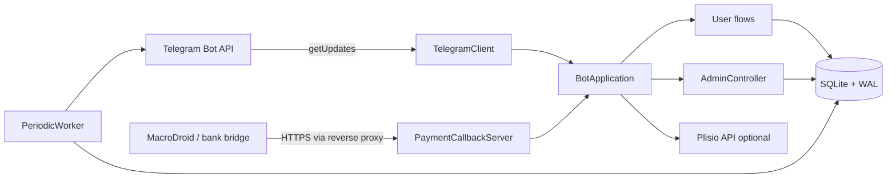

# راهنمای توسعه و تحویل کار به Agentها

این سند مرجع فنی توسعه‌دهنده یا agentی است که باید بدون حدس‌زدن معماری، پروژه را تغییر دهد. رفتار کسب‌وکار از `README.md` و راهنماهای پوشه `docs/`، ساختار قطعی داده از `app/schema.sql` و رفتار قابل اتکا از کد و تست‌ها استخراج می‌شود. اگر بین توضیح و کد اختلافی دیده شد، آن را به‌عنوان نقص مستندات یا پیاده‌سازی ثبت کنید و پیش از تغییر رفتار مالی، تصمیم صریح بگیرید.

## اصول راهنما

- ربات با Python 3.12+، کتابخانه `requests` و SQLite اجرا می‌شود؛ framework خارجی ربات یا ORM ندارد.
- دریافت updateهای تلگرام فقط با `getUpdates` و long polling انجام می‌شود. Telegram webhook بخشی از این پروژه نیست.
- در هر محیط فقط یک نمونه ربات با یک token و یک دیتابیس اجرا می‌شود.
- مبالغ، شمارنده‌ها و chat IDها عدد صحیح هستند. مبلغ اعشاری وارد مدل داده نکنید.
- timestampهای دیتابیس ISO-8601 و UTC هستند؛ تبدیل تاریخ گزارش به timezone تنظیم‌شده در مرز ورودی انجام می‌شود.
- عملیات مالی، تخصیص موجودی و تغییر وضعیت باید در لایه `Database` و داخل تراکنش انجام شوند؛ handler تلگرام محل مناسبی برای SQL مالی نیست.
- هر عملیات قابل تکرار باید کلید idempotency پایدار داشته باشد و استفاده مجدد ناسازگار از همان کلید با `ConflictError` رد شود.
- هیچ secret واقعی، payload واقعی موجودی، شماره تماس واقعی یا داده واقعی پرداخت را در تست، مستندات، commit، exception یا log قرار ندهید. fixture کاملاً ساختگی و غیرقابل انتساب برای تست مجاز است.

## نقشه مخزن

```text
.
├── app/
│   ├── main.py              # CLI، lifecycle، signal و ساخت سرویس‌ها
│   ├── config.py            # خواندن env و Settings با repr سانسورشده
│   ├── telegram.py          # client همگام Bot API و long polling
│   ├── bot.py               # routeهای کاربر، خرید، پرداخت، تحویل و maintenance
│   ├── admin.py             # فرمان‌ها و callbackهای مدیریت و سطح دسترسی
│   ├── admin_help.py        # فهرست فرمان‌ها و syntax نمایش‌داده‌شده به مدیر
│   ├── db.py                # repository تراکنشی و قواعد دامنه
│   ├── schema.sql           # schema کامل دیتابیس تازه
│   ├── keyboards.py         # ساخت keyboard و کنترل متن/آیکون دکمه‌ها
│   ├── texts.py             # templateهای متنی کاربر
│   ├── utils.py             # normalize، قالب مبلغ و HTML امن
│   ├── payment_server.py    # callback احراز‌شده کارت؛ نه webhook تلگرام
│   ├── plisio.py            # adapter اختیاری Plisio
│   └── jobs.py              # worker دوره‌ای داخل همان process
├── tests/                   # unit، integration و regressionهای خصمانه
├── docs/                    # مستندات کسب‌وکار، توسعه، استقرار و عملیات
├── .env.example             # قرارداد پیکربندی بدون secret
├── .dockerignore            # حذف secret/data/test/docs از build context
├── Dockerfile
├── docker-compose.yml
├── alone-account-bot.service.example
├── requirements.txt         # dependencyهای runtime
├── requirements-dev.txt     # runtime + ابزار توسعه pin‌شده، شامل Ruff
└── README.md
```

فایل‌های تولیدی زیر جزو سورس نیستند و نباید commit شوند: `.env`، دیتابیس و فایل‌های `-wal`/`-shm`، بکاپ‌ها، logها، `__pycache__` و فایل‌های پوشش تست. قواعد پایه در `.gitignore` تعریف شده‌اند.

## معماری زمان اجرا



یک process سه مسیر اجرایی احتمالی دارد:

1. thread اصلی long polling را اجرا می‌کند.
2. `PeriodicWorker` در thread غیر-daemon پس‌زمینه عملیات نگهداری را با فاصله `JOB_INTERVAL_SECONDS` اجرا می‌کند.
3. اگر `PAYMENT_CALLBACK_SECRET` تنظیم باشد، HTTP server کارت با listener و request threadهای non-daemon جدا بالا می‌آید.

SQLite برای هر عملیات یک connection تازه باز می‌کند. `foreign_keys=ON`، حالت WAL، `busy_timeout` و برای writeهای حساس `BEGIN IMMEDIATE` فعال است. این طراحی concurrency محدود threadهای همین process را تحمل می‌کند، اما برای چند replica یا filesystem شبکه‌ای طراحی نشده است.

### lifecycle شروع و توقف

`python -m app.main` به‌ترتیب این کارها را انجام می‌دهد:

1. env را می‌خواند و مسیرهای داده را ایجاد می‌کند.
2. schema را می‌سازد یا migrationهای idempotent را اجرا می‌کند.
3. مالک bootstrap و settingهای پیش‌فرض را ثبت می‌کند؛ marker یکتای root و هویت verifyشده در DB بر username محیط اولویت دارند و restart role/active را بازنویسی نمی‌کند.
4. با `getMe` token را می‌شناسد، `deleteWebhook(drop_pending_updates=False)` را اجرا و فرمان‌های پایه را ثبت می‌کند.
5. controller مدیریت و integrationهای اختیاری را می‌سازد.
6. worker نگهداری را شروع می‌کند.
7. از offset ذخیره‌شده در `settings.telegram_update_offset` polling را ادامه می‌دهد.
8. روی `SIGINT` یا `SIGTERM` stop event set می‌شود؛ long poll پس از request جاری بدون retry/backoff اضافه خارج می‌شود، worker پس از آیتم جاری join، listener callback بسته و confirmation requestهای در حال اجرا تا سقف مهلت توقف drain می‌شوند؛ سپس sessionهای شبکه بسته می‌شوند.

offset فقط پس از ACK handler ذخیره و رو به جلو حرکت می‌کند. قرارداد return poller دقیق است: فقط `result is False` یک NACK موقت است؛ `None` و هر مقدار دیگر ACK هستند. `process_update_safe` خطای موقت پایهٔ `DatabaseError` یا `sqlite3.DatabaseError` را False می‌کند؛ subclassهای terminal دامنه و failure پاسخ Telegram ACK می‌شوند تا poison update صف را نبندد. در NACK، update جاری و همه موارد بعدی batch بدون ذخیره offset می‌مانند، batch قطع و همان offset با backoff نمایی سقف‌دار و `stop_event` دوباره poll می‌شود. update مدیریتی احراز‌شده پیش از handler با `begin_admin_update(update_id, fingerprint)` وارد journal می‌شود: `completed` skip، `started` در replay همان payload دوباره اجرا و fingerprint متفاوت conflict می‌شود. handler موفق با `complete_admin_update` terminal می‌شود؛ خطای موقت begin/mutation/complete NACK و replay می‌شود، نه preclaim/حذف همیشگی update. diagnostic retry فقط در تلاش نخست best effort است و failure خودش نباید NACK را به ACK تبدیل کند. toggle غیرidempotent باید مقصد خود را با `get_or_store_admin_update_effect` پیش از mutation freeze کند و create/state/message به idempotency دامنه‌ای متکی بمانند.

قرارداد shutdown برای تغییرهای بعدی:

- callback هر worker باید یک چرخه محدود داشته باشد؛ thread را daemon نکنید و timeout کوتاه دلخواه برای `join` نگذارید.
- callback HTTP و request handlerهایش نیز non-daemon باقی می‌مانند. تغییر shutdown باید بستن listener، انتظار bounded برای request در حال اجرا و نبود thread زنده پس از stop را حفظ کند.
- loopهای maintenance پیش از claim/آیتم بعدی `BotApplication.stop_event` را بررسی کنند. اگر shutdown پس از claim و پیش از ارسال دیده شد، claim پایدار باید همان لحظه به `queued`/`pending` برگردد.
- `BotApplication` stop event را به `TelegramClient` bind می‌کند و polling نیز همان event را صریح می‌فرستد. یک request HTTP در حال اجرا با `requests` قابل قطع امن نیست، اما پس از پایان/خطای همان request هیچ retry، flood-control wait یا backoff تازه برای هیچ call تلگرام شروع نمی‌شود.
- اگر update بعد از setشدن stop event از long poll برگردد و handler شروع نشده باشد، offset ذخیره نمی‌شود؛ replay آن در start بعدی رفتار مورد انتظار است.
- تست تغییر lifecycle باید هم عدم شروع آیتم/handler بعدی و هم باقی‌نماندن thread non-daemon را ثابت کند.

## راه‌اندازی محیط توسعه

### Linux یا macOS

```bash
python3.12 -m venv .venv
. .venv/bin/activate
python -m pip install --upgrade pip
python -m pip install -r requirements-dev.txt
cp .env.example .env
chmod 600 .env
```

### Windows PowerShell

```powershell
py -3.12 -m venv .venv
.\.venv\Scripts\Activate.ps1
python -m pip install --upgrade pip
python -m pip install -r requirements-dev.txt
Copy-Item .env.example .env
```

برای توسعه، bot و دیتابیس آزمایشی مستقل بسازید. هرگز token یا دیتابیس production را برای تست دستی استفاده نکنید. حداقل env محلی:

```dotenv
BOT_TOKEN=REPLACE_WITH_A_DEVELOPMENT_BOT_TOKEN
DATA_DIR=./data-dev
DATABASE_PATH=./data-dev/development.sqlite3
BOOTSTRAP_ADMIN_USERNAME=replace_with_test_username
BOOTSTRAP_ADMIN_CHAT_ID=
LOG_LEVEL=INFO
```

دستورهای lifecycle:

```bash
# فقط ساخت/ارتقای schema؛ به Telegram وصل نمی‌شود
python -m app.main --env-file .env --migrate-only

# اعتبارسنجی env، دیتابیس و token با getMe؛ دیتابیس را نیز migrate می‌کند
python -m app.main --env-file .env --check

# اجرای واقعی long polling
python -m app.main --env-file .env
```

`--check` read-only خالص نیست: `Database.initialize()` را اجرا می‌کند، owner bootstrap را با username/chat ID محیط روی همان DB ایجاد یا اعتبارسنجی می‌کند و سپس `getMe` را می‌زند. پس از اثبات اولیه، private chat/user ID و marker یکتای `is_bootstrap_owner` anchor هستند؛ drift username همان chat metadata است، restart owner غیرفعال‌شده را فعال نمی‌کند و تغییر configured chat ID فقط وقتی marker را منتقل می‌کند که مقصد از قبل owner فعال و verifyشده باشد. تعارض legacy یا مقصد اثبات‌نشده پیش از تماس Telegram fail closed است. آن را روی دیتابیس production فقط در پنجره استقرار، بعد از بکاپ و با identity نهایی release اجرا کنید.

## قرارداد پیکربندی

منبع تنظیم به‌ترتیب process environment، فایل انتخابی با `--env-file` یا `ENV_FILE`، و سپس `.env` ریشه پروژه است. environment بر فایل اولویت دارد.

| متغیر | اجباری | کاربرد |
|---|---:|---|
| `BOT_TOKEN` | بله | token محرمانه BotFather |
| `DATA_DIR` | خیر | پوشه داده؛ پیش‌فرض `./data` |
| `DATABASE_PATH` | خیر | فایل SQLite |
| `BOOTSTRAP_ADMIN_USERNAME` | خیر | username اولیه/metadata مالک، بدون `@` هم معتبر؛ پس از verify مبنای مجوز نیست |
| `BOOTSTRAP_ADMIN_CHAT_ID` | خیر | private chat/user ID پایدار مالک؛ برای production لازم و تنها راه پیکربندی انتقال marker به owner verifyشده |
| `TIMEZONE` | خیر | timezone گزارش و تاریخ مدیریتی، پیش‌فرض `Asia/Tehran` |
| `CURRENCY_LABEL` | خیر | فقط برچسب نمایشی؛ currency دامنه ثابت `TOMAN` است و مقدار production باید «تومان» بماند |
| `POLL_TIMEOUT_SECONDS` | خیر | timeout هر long poll |
| `REQUEST_TIMEOUT_SECONDS` | خیر | timeout شبکه Bot API |
| `JOB_INTERVAL_SECONDS` | خیر | فاصله اجرای maintenance |
| `ORDER_EXPIRY_MINUTES` | خیر | مهلت پایه سفارش پرداخت‌نشده |
| `RECEIPT_DELAY_SECONDS` | خیر | تأخیر محافظ فیش/تطبیق کارت |
| `TELEGRAM_API_BASE` | خیر | URL Bot API؛ non-loopback فقط HTTPS، HTTP فقط `localhost`/زیردامنه آن یا IP loopback؛ credential/query/fragment ممنوع |
| `PAYMENT_CALLBACK_BIND/PORT` | خیر | bind داخلی HTTP callback کارت |
| `PAYMENT_CALLBACK_SECRET` | خیر | خالی یعنی callback خاموش؛ در حالت فعال دقیقاً ۴۳ تا ۱۲۸ نویسه URL-safe از `[A-Za-z0-9_-]` |
| `PUBLIC_PAYMENT_CALLBACK_URL` | خیر | رزرو برای integration سازگار؛ اگر پر شود فقط URL مطلق HTTPS بدون credential/host literal محلی یا خصوصی مجاز است و endpoint کارت مقصد Plisio نیست |
| `PLISIO_API_KEY` | خیر | ساخت client پرداخت crypto در startup؛ نمایش روش علاوه بر key به setting فعال نیاز دارد |
| `PLISIO_CURRENCY` | خیر | ارز invoice، پیش‌فرض `USDT_TRX` |
| `PLISIO_SOURCE_CURRENCY` | خیر | ارز مبدا provider، پیش‌فرض `IRR` |
| `PLISIO_AMOUNT_MULTIPLIER` | خیر | تبدیل تومان به ریال، پیش‌فرض `10` |
| `LOG_LEVEL` | خیر | سطح logging |
| `BUTTON_ICON_*` | خیر | custom emoji ID؛ متن دکمه همچنان بدون ایموجی است |

افزودن متغیر جدید نیازمند تغییر هم‌زمان `Settings`، `load_settings`، `.env.example`، README/راهنمای deployment و تست config است. `Settings.__repr__` باید secretها را سانسور کند.

برای مقدار callback از مولد رمزنگارانه استفاده کنید؛ `python -c "import secrets; print(secrets.token_urlsafe(32))"` یک مقدار ۴۳ کاراکتری سازگار می‌سازد. خروجی واقعی را فقط در secret store/env محدودشده قرار دهید. تست‌های config باید هم مقدار معتبر مرزی و هم secret کوتاه/غیر URL-safe و `TELEGRAM_API_BASE` غیر-loopback روی HTTP را fail-closed پوشش دهند.

## مدل دامنه و schema

نسخه فعلی schema در `schema_meta` برابر `11` است. `schema.sql` شکل کامل دیتابیس تازه را می‌سازد و سپس `Database._migrate_schema` دیتابیس‌های قدیمی را به شکل جاری می‌رساند. نسخه ۷ جدول immutable `provider_payment_event_resolutions` نسخه ۶ را برای action جدید `credit_confirmed` و CHECK دقیق actor/resolving-event تراکنشی rebuild می‌کند. نسخه ۸ ستون constrained `orders.order_origin` را اضافه و الگوهای legacy `ADM-%`/`admin-inventory:%` را `admin_assignment` می‌کند. تغییرهای بعدی تا ۱۱ attachment kind تیکت، `source_admin_update_id` برای createهای مدیریتی، هویت/marker bootstrap و journal کامل admin update را idempotently اضافه/backfill می‌کنند. index وابسته به ستون legacy تازه، مانند `uq_admin_bootstrap_owner`، باید فقط پس از افزودن ستون در migration ساخته شود؛ `test_live_v5_admin_shape_migrates_before_new_column_indexes` روی کپی شکل واقعی DB v5 و `test_previous_release_schema_migrates_idempotently` حفظ داده، journal legacy، integrity/FK و اجرای دوباره را قفل می‌کنند.

| حوزه | جدول‌ها | نکته کلیدی |
|---|---|---|
| هویت و تنظیم | `users`, `admins`, `settings`, `user_states`, `processed_admin_updates` | هویت مدیر با chat ID verifyشده؛ state گفتگو پایدار؛ journal `started/completed` با fingerprint/effect |
| دسترسی و کاتالوگ | `force_join_channels`, `categories`, `products` | دسته تو در تو، محصول `ready` یا `manual` و snapshot مشخصات در سفارش |
| سفارش و انبار | `orders`, `inventory_items`, `reservations` | `order_origin` برای تفکیک خرید مشتری/تخصیص داخلی، تخصیص اتمیک، صف FIFO و تحویل پایدار |
| تخفیف و پرداخت | `discounts`, `order_discounts`, `payments`, `payment_receipt_attachments`, `card_payment_events`, `card_payment_event_resolutions`, `provider_payment_events`, `provider_payment_event_resolutions`, `card_payment_cancellations`, `payment_security_events` | intent و فیش بازیابی‌پذیر؛ شاهد/provider review و تصمیم‌ها حسابرسی‌پذیر؛ یکتایی مبلغ فعال فقط card |
| کیف پول | `wallet_entries` | دفترکل append-only با trigger منع update/delete |
| پشتیبانی | `faq_categories`, `faqs`, `tickets`, `ticket_messages` | گفتگو و attachment با مالکیت و idempotency |
| ارسال | `outbound_messages`, `outbound_message_attempts`, `broadcast_batches`, `broadcast_batch_messages` | outbox پایدار، retry محدود و گزارش batch |
| دعوت و پاداش | `referrals`, `reward_rules`, `reward_events` | هر invitee یک دعوت، event یکتا و اثر مالی idempotent |
| نگهداری | `reminders`, `backups` | claim پایدار reminder و ثبت metadata/hash بکاپ |

### قواعد migration

برای هر تغییر schema:

1. ابتدا تست migration از schema نسخه قبلی بنویسید.
2. `app/schema.sql` را برای نصب تازه به‌روز کنید.
3. تغییر متناظر و idempotent را در `_migrate_schema` اضافه کنید؛ وجود table/column/index را بررسی کنید.
4. migration را داخل همان `BEGIN IMMEDIATE` نگه دارید و نسخه `schema_meta` را افزایش دهید.
5. migration باید در اجرای دوم بدون تغییر و بدون خطا تمام شود.
6. روی نسخه کپی‌شده دیتابیس production و بدون token واقعی تست کنید.
7. قبل از اجرای production بکاپ معتبر و روش rollback داشته باشید.

SQLite پشتیبانی کامل از همه شکل‌های `ALTER TABLE` ندارد. برای rebuild جدول، foreign keyها، indexها، triggerها، داده legacy و حالت failure میانی را تست کنید. migration destructive یا تبدیل برگشت‌ناپذیر بدون release plan و بکاپ ممنوع است.

## invariantهای غیرقابل شکستن

### سفارش و وضعیت

انتقال وضعیت فقط مطابق `Database.ORDER_TRANSITIONS` و guardهای دامنه‌ای مجاز است. وضعیت‌های دارای پول captureشده (`paid`, `awaiting_stock`, `awaiting_info`, `processing`, `completed`) نباید با shortcut به `cancelled` یا `rejected` بروند. علاوه بر آن، `update_order_status` باید مقصد `cancelled|expired|rejected` را در حضور هر external payment `pending/verifying` رد کند؛ card receipt فقط از reject workflow و crypto از provider evidence تعیین تکلیف می‌شود. مسیر مالی برگشت آینده باید `refunded` و دفترکل متناظر را در یک workflow اثبات‌شده بسازد؛ نسخه فعلی ورود به `refunded` را عمداً رد می‌کند. `expired`، `cancelled` و `refunded` terminal هستند.

مشخصات مهم محصول هنگام ساخت سفارش snapshot می‌شوند تا ویرایش بعدی محصول تاریخچه سفارش را عوض نکند. قیمت نهایی همیشه از دیتابیس محاسبه می‌شود؛ callback کاربر نباید مبلغ یا محصول دلخواه تزریق کند.

در پایان first-contact، `BotApplication._create_order_and_confirm` باید `Database.create_order(..., order_notice=...)` را صدا بزند تا Order و خلاصه `order:{id}:created-summary` در همان transaction نوشته شوند. state خرید فقط پس از commit پاک می‌شود. تکرار همان idempotency key باید همان Order و همان notice را برگرداند؛ ارسال مستقیم خلاصه پیش از commit یا پاک‌کردن state پیش از ساخته‌شدن outbox ممنوع است.

### پرداخت و کیف پول

- `payments` برای `order` حتماً `order_id` دارد و برای `wallet_topup` ندارد.
- محصول و payment فقط currency برابر `TOMAN` می‌پذیرند؛ `CURRENCY_LABEL` یک label رابط کاربری است، نه انتخاب ارز.
- انتقال وضعیت فقط مطابق `PAYMENT_TRANSITIONS` است؛ payment در `paid` terminal و مجموعه transition آن خالی است. `set_payment_status(..., "refunded")` عمداً همیشه رد می‌شود تا workflow مالی اثبات‌شده جداگانه، همراه reversal لازم، اضافه شود.
- برای هر `(method, currency, payable_amount)` فقط در روش card یک پرداخت فعال `pending/verifying` و برای هر Order در مجموع card/crypto فقط یک external intent فعال وجود دارد. ساخت intent دوم با terms متفاوت conflict است؛ replay دقیق همان intent همان رکورد را برمی‌گرداند. crypto با invoice/reference provider یکتا می‌شود و مبلغ آن برای یکتاسازی دست‌کاری نمی‌شود.
- برای هر user در مجموع card/crypto فقط یک topup تازه فعال مجاز است. replay تنها با method/amount/terms یکسان همان رکورد را می‌دهد؛ اختلاف هرکدام conflict است و هیچ topup به‌طور ضمنی replace/cancel نمی‌شود. `list_active_wallet_topup_payments` برخلاف guard ساخت، همه ردیف‌های فعال را برمی‌گرداند تا اگر دیتابیس legacy هم card و هم crypto فعال داشت، UI هر دو را برای resume نشان دهد.
- Order/topup crypto را قبل از تماس شبکه با `create_order_payment`/`create_wallet_topup_payment` به‌صورت provisional بسازید؛ user/purpose/base amount و terms در همان رکورد ثابت می‌شوند و `payment_number` باید `order_number` ثابت `create_invoice(return_existing=1)` باشد. ساخت provisional Order را به `awaiting_confirmation` می‌برد تا hold/discount بعدی terms invoice را تغییر ندهد. نتیجه provider فقط با `attach_crypto_invoice(payment_id, user_id, ...)` و validation URL/identity/collision اتمیک attach می‌شود. در exception مبهم provisional را حذف/terminal نکنید؛ retry باید همان merchant order/amount را به provider بدهد و UI provisional را قابل retry نگه دارد.
- مبلغ terminal کارت تا ۲۴ ساعت بعد از `max(expires_at, updated_at)` در `CARD_AMOUNT_REUSE_COOLDOWN` quarantine است. تغییر window/query/index باید سناریوی transfer دیررس پس از cancel/expiry و reuse پس از پایان window را تست کند.
- reference بیرونی و `provider_invoice_id` یکتا هستند.
- `provider_invoice_url` و callback عمومی فقط URL مطلق HTTPS بدون credential، `localhost`، IP literal محلی/خصوصی/reserved یا host عددی مبهم می‌پذیرند. `rules_url`، rich-HTML href و همه URL buttonها نیز همین validator را در write/render دارند؛ لینک کانال/invite Telegram باید علاوه بر آن canonical باشد. validator DNS lookup نمی‌کند و نباید به‌عنوان تضمین مقصد پس از resolve معرفی شود.
- تأیید Payment/Order یا topup و ثبت رویداد `confirmed` با reference یکتا در `card_payment_events` باید در یک transaction انجام شود؛ رویداد دیررس یا ناسازگار نباید به پرداخت کاربر دیگری وصل شود.
- اعلان موفقیت Order باید متن canonical شماره سفارش، محصول، مبلغ و روش را با کلید `payment:{payment_id}:order-confirmed` یا، برای wallet-only و تخفیف کامل، به‌ترتیب با کلیدهای `order:{order_id}:wallet-confirmed` و `order:{order_id}:discount-confirmed` بسازد. همه شاخه‌های ready/reserve/manual پیش از mutation `order_success_notice_ready` را بررسی می‌کنند: نبود پیام و statusهای `queued/sending` fulfillment را به تعویق می‌اندازد؛ `sent/failed/cancelled` اجازه ادامه می‌دهد تا failure دائمی Telegram سفارش paid را strand نکند. maintenance باید missing notices را با cursor/wrap پیش از reward/fulfillment بازیابی کند.
- مشاهده provider پیش از settlement به‌صورت immutable و hash‌شده در `provider_payment_events` ثبت می‌شود. completed با `id/type=invoice` منطبق تنها شاهد settlement است؛ `operation.amount` مقدار crypto است و نباید با تومان/base amount مقایسه شود. terminal با crypto amount صفر شکست قطعی و partial/nonzero/unknown، پاسخ مبهم یا mismatch فیلد fiat/source در `params` در صورت حضور مسیر review است. رخداد completed ثبت‌شده ولی اعمال‌نشده باید بدون network از maintenance بازیابی شود.
- review کارت/provider فقط با تصمیم owner فعال و note بسته می‌شود. تغییر status یا action دستی به‌تنهایی شاهد پول نیست؛ هر credit باید به completed evidence معتبر متصل و با idempotency key پرداخت در wallet ledger ثبت شود.
- سقف کارت ۲۰ intent در ۲۴ ساعت است و ۳ لغو در یک ساعت ساخت تازه را وارد cooldown می‌کند. تغییر این ثابت‌ها، query شمارش، `card_payment_cancellations` یا `payment_security_events` نیازمند regression test برای replay، مرز زمان و اعلان پایدار است.
- فیش فقط برای card است؛ نخستین فیش strictly پیش از `expires_at` و replacement فقط strictly پیش از `expires_at + 7 days` پذیرفته می‌شود. grace به deadline اولیه متصل است و replacement آن را جلو نمی‌برد. Order/topup crypto باز باید فقط از `provider_invoice_url` ذخیره‌شده و دوباره‌اعتبارسنجی‌شده با دکمه URL قابل resume باشد؛ URL خالی/legacy ناامن لینک یا callback receipt تولید نمی‌کند و مسیر پشتیبانی می‌دهد.
- alert مدیریتی فیش با hash نوع/شناسه فایل و alert اطلاعات سفارش manual با hash JSON کامل نسخه‌بندی می‌شود. retry یا restart همان نسخه را تکرار نمی‌کند، ولی محتوای جایگزین کلید outbox جدید دارد و از `/payment_detail` یا `/order_attachment` قابل بازیابی است؛ این hash کنترل دسترسی یا رمزنگاری نیست.
- لغو کاربر فقط card payment متعلق به او با status=`pending` و بدون فیش را می‌پذیرد؛ payment، parent order، hold، discount، reminder و reservation در یک transaction reconcile می‌شوند و callback قدیمی نمی‌تواند فیش ثبت‌شده را لغو کند. crypto invoice صادرشده نه دکمه لغو دارد و نه در repository قابل cancel است؛ deadline محلی آن را terminal نمی‌کند و poll برای نتیجه provider/late transition ادامه می‌یابد. در UI تغییر card به crypto یعنی لغو card، terminalشدن Order و آغاز خرید تازه.
- موجودی کیف پول برابر مجموع `wallet_entries.amount_signed` است. entry قبلی هرگز update/delete نمی‌شود؛ اصلاح با entry جبرانی و idempotency key جدید انجام می‌شود.
- hold، release، capture و refund کیف پول باید با order یک تراکنش سازگار بسازند. تغییر مستقیم ستون‌های مبلغ سفارش یا موجودی ممنوع است.

### موجودی و تحویل

- payload موجودی با hash در هر محصول یکتا و داده محرمانه است.
- خروجی نهایی credential برای ready و متن نهایی `/complete` برای manual باید پیش از mutation در سقف `Database.TELEGRAM_SAFE_MESSAGE_LENGTH=3900` جا شود. ready delivery در add/edit موجودی، تغییر فیلدهای مؤثر محصول و assignment دوباره با renderer production سنجیده می‌شود؛ رکورد legacy بلند نیز بدون تخصیص رد می‌شود. این پیام‌های تحویل نه truncate و نه split می‌شوند.
- فقط item با وضعیت `available` قابل تخصیص است؛ تخصیص هم‌زمان داخل `BEGIN IMMEDIATE` انجام می‌شود.
- در تخصیص دستی admin، assignment، سفارش completed `ADM-...` با `order_origin=admin_assignment` و marker پاداش ازپیش‌پردازش‌شده، و delivery outbox با کلید پایدار در همان transaction ساخته می‌شوند؛ ساخت‌نشدن outbox باید همه تغییرها را rollback کند. این Order خرید تجاری نیست و نباید پاداش خرید/نخستین خرید، خریدار یا درآمد فروش بسازد؛ queryهای تجاری فقط `order_origin=customer` و `subtotal_amount > 0` را می‌پذیرند.
- محصول `ready` در صورت موجودی تحویل و complete می‌شود؛ در نبود موجودی و فعال‌بودن رزرو، سفارش پرداخت‌شده وارد `awaiting_stock` می‌شود.
- reservation سفارش‌دار بر اساس order یکتا و صف fulfilment بر اساس ID به‌صورت FIFO است.
- محصول `manual` پس از پرداخت وارد `awaiting_info`/`processing` می‌شود و مدیر آن را تکمیل می‌کند.
- زمان اشتراک و reminder از لحظه تحویل واقعی یا تکمیل دستی محاسبه می‌شود، نه زمان پرداخت.

### idempotency، crash recovery و ارسال

کلید idempotency باید از هویت رویداد پایدار ساخته شود، مانند `order:{id}:delivery` یا `reward:{id}:notice`؛ UUID تازه در retry همان عملیات خطاست. متدهای repository باید علاوه بر یافتن کلید موجود، تطابق user/order/amount/purpose/body را بررسی کنند. بازگرداندن رکورد متعلق به عملیات دیگری نقص امنیتی است.

maintenance به‌ترتیب completed evidence اعمال‌نشده را settle و سپس crypto را poll می‌کند؛ بعد alertهای review، notice تصمیم‌های provider/card، alert فیش/manual-info/no-stock/reward-event/ticket/security، انقضاهای محلیِ غیرcrypto و اعلان terminal آن‌ها را بازیابی می‌کند. سپس paid-noticeهای بیرونی و success-noticeهای wallet-only/تخفیف کامل missing را می‌سازد، و فقط بعد از این dependency به پاداش سفارش‌های موفق با `reward_processed_at IS NULL` و selector مستقل fulfillment همه سفارش‌های status=`paid` می‌رسد. prompt سفارش‌های `awaiting_stock`/`awaiting_info`، رزرو موجودی، fulfil سفارش ready در `processing` پس از restock، delivery سفارش ready تکمیل‌شده، reminder، outbox و batch broadcast مراحل بعدی‌اند. deadline محلی به‌تنهایی crypto را terminal نمی‌کند. marker پاداش فقط بعد از ثبت اعلان‌های پایدار زده می‌شود و هرگز selector fulfillment نیست. commit انقضا و پیام «دیگر پرداخت نکن» باید یا اتمیک باشد یا با query ردیف terminal فاقد outbox بازیابی شود؛ crash بین این دو نباید اعلان را برای همیشه گم کند.

`reminder_days` ورودی تازه فقط integer مثبت است؛ صفر یا منفی در product create/update و schedule رد می‌شود و صفر legacy هنگام schedule نادیده گرفته می‌شود. reminder با موعدی که هنگام schedule گذشته است ساخته نمی‌شود. reminderها با batch محدود claim و هر عضو مستقل پردازش می‌شوند؛ failure دائمی یک recipient نباید اعضای بعدی را starve کند. worker پیش از پیام، اشتراک پایان‌یافته را `cancelled` و روز باقی‌مانده مورد دیررسِ معتبر را از `subscription_ends_at - now` با `ceil` و حداقل ۱ محاسبه می‌کند؛ متن نباید `days_before` تاریخی را تکرار کند. از لحظه وجود outbox `queued/sending` با کلید `reminder:{id}`، retry در مالکیت outbox است و reminder تا stale reconciliation `processing` می‌ماند؛ release فوری فقط وقتی outbox ساخته نشده یا shutdown پیش از شروع همان آیتم رخ داده مجاز است.

budgetهای صریح `MAINTENANCE_*_LIMIT=100` برای reward، paid fulfillment، reservation، ready-processing، order notice، ticket alert و success-notice بدون external از طولانی‌شدن یک چرخه جلوگیری می‌کنند. مسیر reward، selector مستقل paid-fulfillment، noticeهای Order/ticket و success-notice بدون external با `after_id`/query missing و cursor پایدار صفحه‌بندی و در انتها wrap می‌شوند؛ notice تمام `reward_event`ها و alert no-stock نیز cursor/wrap مستقل دارند. مسیر رزرو قدیمی‌ترین reservation دارای stock و مسیر ready-processing قدیمی‌ترین سفارش `processing` واجد stockِ بدون reservation قدیمی‌تر همان product را انتخاب می‌کنند. هنگام تغییر این مقادیر یا queryها، تست کنید backlog بزرگ‌تر از cap در یک run محدود بماند، run بعدی پیشرفت کند و failure قدیمی موجب starvation نشود.

reconcilerهای notice سفارش pending، انقضا و delivery تکمیل‌شده باید خودِ «فاقد کلید outbox متناظر» را در query محدود/مرتب انتخاب کنند یا cursor/wrap پایدار داشته باشند؛ گرفتن ثابت newest N و سپس filter در حافظه ردیف قدیمی missing را starve می‌کند. summary broadcast نیز failure دائمی delivery summary را attempt نهایی و حسابرسی‌پذیر می‌شمارد تا batch قدیمی با `notified_at IS NULL` ظرفیت همه دورها را اشغال نکند؛ batchهای بعدی باید پیشرفت کنند.

اثر مالی و تخصیص موجودی باید exactly-once منطقی باشد. ارسال شبکه‌ای تلگرام در failure مبهم ذاتاً تضمین exactly-once ندارد؛ outbox، status و کلید پایدار احتمال تکرار را کم می‌کنند، اما متن اعلان باید در برابر دریافت تکراری قابل فهم باشد. رکورد `sent` نباید برای retry دوباره `queued` شود.

outbox یک claim پنج‌دقیقه‌ای قابل بازیابی دارد و خطاهای موقت را با backoff نمایی تا سقف ۱۲ تلاش retry می‌کند. خطای دائمی 4xx به‌جز 429 باید terminal شود؛ 429 باید `retry_after` را رعایت کند.

## توسعه یک جریان کاربر

ترتیب پیشنهادی:

1. use case، actor، precondition، stateها، failureها و اثر مالی را در مستند کسب‌وکار مشخص کنید.
2. عملیات دامنه را به‌صورت متد public در `db.py` با validation، transaction و idempotency پیاده کنید.
3. متن نمایشی را در `texts.py` یا helper امن قرار دهید.
4. keyboard را با builderهای `keyboards.py` بسازید. متن دکمه نباید Unicode emoji داشته باشد، `callback_data` حداکثر ۶۴ byte است و action هر inline button دقیقاً یکی است.
5. callback را در dispatcher مناسب `bot.py` با parser fail-closed اضافه کنید؛ ID، مالکیت entity، وضعیت جاری و دسترسی کاربر را دوباره از DB اعتبارسنجی کنید.
6. برای ورودی چندمرحله‌ای از `user_states` استفاده کنید. state که stale یا ناسازگار است باید پاک شود، نه اینکه entity بسته را mutate کند.
7. اعلان حساس را قبل از ارسال در outbox ثبت کنید.
8. تست happy path، callback malformed، callback قدیمی، entity کاربر دیگر، replay، restart و شکست بین commit و send را اضافه کنید.

فقط private chat معتبر است. contact باید متعلق به همان Telegram user باشد. متن معمولی escape می‌شود؛ rich text فقط با پیشوند صریح `html:` و validator محدود Telegram پذیرفته می‌شود.

## توسعه فرمان مدیریت

برای افزودن فرمان:

1. نام را به `DOCUMENTED_COMMANDS` و `_handlers` در `admin.py` اضافه کنید.
2. syntax را در `admin_help.py` و راهنمای مدیر مستند کنید.
3. role را تعیین کنید. `support` فقط فرمان‌های موجود در `SUPPORT_COMMANDS` را دارد؛ `/ticket_attachment MESSAGE_ID` برای owner/admin/support با revalidation نقش، وجود پیام و تیکت مجاز است، اما receipt/payment detail و manual-order attachment فقط `owner/admin` هستند و عملیات مالی، تغییر تنظیمات و تکمیل سفارش برای support مجاز نیست.
4. handler فقط در private chat اجرا شود و ورودی را با `AdminInputError` قابل نمایش رد کند.
5. عملیات مالی را به متد `Database` بسپارید. SQL fallback در controller را توسعه ندهید مگر برای compatibility موقت و با تست مستقل.
6. ورودی محرمانه مانند payload انبار را با state `admin:*` دریافت کنید و در پاسخ echo نکنید.
7. برای عملیات callback نقش را دوباره بررسی کنید؛ اعتماد به صفحه‌ای که قبلاً نمایش داده شده کافی نیست.
8. اگر فرمان mutation است، journal `begin_admin_update`/`complete_admin_update`، fingerprint collision و replay ردیف `started` را تست کنید. toggle باید `get_or_store_admin_update_effect` و create/state/message باید idempotency دامنه‌ای متناظر داشته باشد.

تست `test_every_documented_command_is_registered` باید همچنان پاس شود. برای خروجی فهرست و گزارش، محدودیت طول پیام تلگرام، pagination، CSV UTF-8 و خنثی‌سازی CSV formula injection را حفظ کنید. قرارداد surfaces پرتعداد مدیریت page size برابر ۲۰، count هم‌فیلتر و ترتیب deterministic دارد: orders با `id DESC`، tickets با `updated_at DESC` و users با `id DESC`. چهار فرمان `/user_orders`، `/user_transactions`، `/user_referrals` و `/user_rewards` باید تاریخچه کامل، total و navigation قبلی/بعدی بدهند؛ `/user` فقط preview است و MIN/MAX اولین/آخرین خرید از aggregate uncapped می‌آید. `_send_blocks` ردیف‌های همان صفحه را split می‌کند و silently drop نمی‌کند. هر تغییر باید `test_order_and_ticket_indexes_page_every_record_without_clamping`، `test_large_user_lists_are_paged_and_join_lists_are_split_safely` و `test_user_history_commands_page_filter_search_and_show_reward_details` را حفظ کند.

## توسعه روش پرداخت یا provider جدید

provider جدید باید adapter مستقل از `bot.py` داشته باشد و این قرارداد را رعایت کند:

- secret فقط از `Settings` وارد adapter شود و در `repr`، URL خطا، exception chain، traceback یا log نمایش داده نشود؛ exception دامنه‌ای سانسورشده را با حذف cause محرمانه propagate کنید.
- ساخت intent/invoice و بررسی وضعیت از هم جدا باشند.
- amount، currency، user، order، purpose و provider reference در replay دقیقاً تطبیق داده شوند.
- نتیجه provider فقط پس از اعتبارسنجی server-side هویت invoice و ثبت durable evidence به settlement برسد؛ crash بعد از ثبت evidence و قبل از اثر مالی باید بدون network قابل recovery باشد.
- timeout و پاسخ نامشخص به معنی شکست قطعی مالی نیست؛ ابتدا قابل retry/reconcile باشد.
- callback عمومی authentication، محدودیت body، JSON strict، timestamp timezone-aware و reference یکتا داشته باشد.
- خطاهای provider به exception دامنه‌ای سانسورشده تبدیل شوند.
- wallet topup و order payment هر دو، شامل partial wallet، terminal-zero، review، completed دیررس، expiry محلی و منع refund/credit بدون شاهد تست شوند.
- `operation.amount` را مبلغ crypto بدانید، نه `TOMAN`. فقط اگر `params.source_amount`, `params.source_currency` یا `params.currency` حاضر بود آن فیلد حاضر را با terms intent تطبیق دهید؛ نبود این فیلدهای اختیاری completion معتبر را رد نمی‌کند، ولی نوع نامعتبر `params` یا mismatch هر فیلد حاضر review است.

endpoint فعلی کارت فقط `GET /health` و `POST /payments/card/confirm` دارد و هر دو authentication می‌خواهند. این endpoint webhook تلگرام یا callback Plisio نیست. آن را پشت HTTPS و reverse proxy نگه دارید.

## تست و کنترل کیفیت

تست‌ها بدون شبکه و بدون token واقعی اجرا می‌شوند:

```bash
python -m unittest discover -s tests -v
python -m compileall -q app tests
```

```bash
python -m ruff check .
```

Ruff جزو dependency runtime نیست، اما نسخه آن در `requirements-dev.txt` pin شده است. `.dockerignore` فایل‌های غیرلازم را از build context حذف می‌کند؛ `.gitignore` همچنان مسئول جلوگیری از commit artifactهای محلی است.

نقشه پوشش مهم:

- `test_db.py`: هویت، کاتالوگ، concurrency انبار، کیف پول، تخفیف، پرداخت، پاداش، reminder و backup.
- `test_db_adversarial_regressions.py`: migration legacy، collisionهای idempotency، refund، replay و recovery دیرهنگام.
- `test_bot.py`: جریان کامل خرید/پرداخت/تحویل، crash recovery، journal/NACK end-to-end، سقف و پیشرفت batch نگه‌داری، رزرو و referral.
- `test_user_flow_adversarial.py` و `test_user_history_pagination.py`: callback مخرب/قدیمی، مالکیت، state و pagination.
- `test_admin.py`: نقش‌ها، CRUD، پیمایش کامل users/orders/tickets و تاریخچه user، گزارش، broadcast، backup و تأیید پرداخت.
- `test_payment_server.py`, `test_plisio.py`, `test_telegram.py`: مرزهای شبکه، ACK/NACK offset، backoff سقف‌دار، لغو retry/backoff هنگام shutdown و عدم افشای secret حتی در traceback.
- `test_repository_hygiene.py`, `test_documentation.py`: اسکن targeted secret/runtime artifacts، صحت لینک/manifest منابع و قرارداد repository.
- `test_keyboards.py`, `test_texts.py`, `test_config_utils.py`, `test_jobs.py`: قرارداد UI، متن، env و joinشدن worker غیر-daemon.

تست جدید باید از `TemporaryDirectory` و دیتابیس فایل‌محور مستقل استفاده کند، زمان را inject کند، شبکه را fake کند و به ترتیب اجرای تست‌ها وابسته نباشد. برای تغییر مالی حداقل این حالت‌ها را پوشش دهید: اجرای نخست، replay یکسان، collision ناسازگار، failure وسط مسیر، retry بعد از restart، concurrency و rollback کامل.

## Definition of Done

تغییر زمانی آماده ادغام است که همه موارد مرتبط برقرار باشند:

- acceptance criteria و اثر کسب‌وکار روشن و مستند شده است.
- مسیر موفق، خطا، لغو، timeout، replay و دسترسی غیرمجاز تعیین تکلیف شده‌اند.
- هیچ invariant مالی/انبار/نقش شکسته نشده و write حساس در تراکنش است.
- idempotency key پایدار است و collision ناسازگار تست دارد.
- migration برای دیتابیس تازه و legacy، اجرای مجدد و rollback عملیاتی بررسی شده است.
- پیام‌ها از محدودیت Telegram عبور نمی‌کنند؛ callbackها fail-closed و مالکیت‌سنج هستند.
- secret/PII/payload در diff، fixture، log و artifact وجود ندارد.
- `unittest` و `compileall` کامل پاس می‌شوند و lint configured سبز است.
- تست regression برای باگ رفع‌شده اضافه شده است.
- README، راهنمای مدیر، development/deployment/operations و نمودارهای مرتبط با رفتار جدید sync شده‌اند.
- deploy و rollback در محیط staging با bot و DB آزمایشی انجام شده است.
- diff فقط شامل تغییرات مرتبط است و فایل تولیدی یا cache ندارد.

## چک‌لیست handoff برای Agent بعدی

در پایان هر نوبت، این اطلاعات را در گزارش تحویل ثبت کنید:

```text
هدف و acceptance criteria:
فایل‌های تغییرکرده:
تصمیم‌های دامنه‌ای و دلیل:
schema_version قبل/بعد:
migration و نتیجه اجرای دوباره:
idempotency keys جدید یا تغییرکرده:
تست‌های افزوده/اجراشده و خروجی دقیق:
بررسی عدم افشای secret:
روش deploy و rollback آزمایش‌شده:
ریسک‌ها، فرض‌ها و کار باز:
```

Agent بعدی باید پیش از تغییر، `git status`، diff موجود، نسخه schema، تست‌های مرتبط و وضعیت اجرای service را بررسی کند. تغییرات کاربر یا agent قبلی را reset نکند. برای production ابتدا بکاپ و فقط سپس migration انجام دهد. هیچ‌گاه برای «رفع سریع» وضعیت پرداخت، کیف پول، موجودی، outbox یا marker پاداش را مستقیم با SQL دست‌کاری نکند.

## ضدالگوهای ممنوع

- اجرای دو poller با یک token.
- قرار دادن token در command line، URL، Docker image، issue یا commit.
- استفاده از float برای پول.
- update/delete رکورد `wallet_entries`.
- پذیرش amount، status، user ID یا product ID صرفاً از callback کاربر/provider.
- ساخت UUID تازه در هر retry یک عملیات منطقی.
- ارسال اعلان حساس قبل از commit یا بدون outbox پایدار.
- تبدیل خطای شبکه مبهم به `failed/refunded` بدون reconciliation.
- دست‌کاری schema production با SQL دستی و بدون بکاپ/تست migration.
- افزودن فرمان مدیریت بدون role check، help و regression test.
- نمایش payload موجودی یا PII در log و متن خطا.
